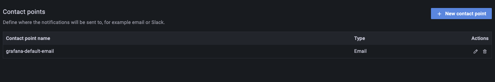
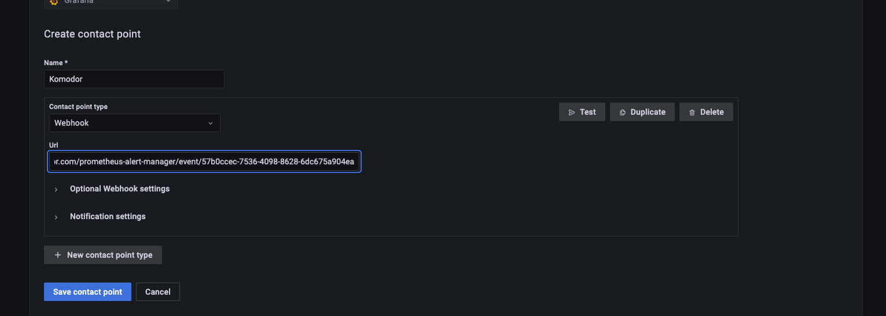
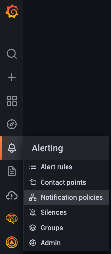

# Prometheus/Grafana Alert Manager Integration

Integration with alert manager reports alerts also to Komodor. We connect the alert to the Kubernetes workload and display the events on the timeline.

---

## Installation

### The Alert Manager integration involves 3 parts:

1. Enabling the integration in Komodor.
2. Creating webhook on the alert manager / Grafana.
3. Adding labels to the alert.

---

### 1. Enabling the integration in Komodor

To enable the Komodor Prometheus Alert Manager integration go to [Komodor integrations page](https://app.komodor.com/main/integration) and select Prometheus/Grafana Alert Manager.

### 2. (Option A) The following steps are for manual configuration on alert manager

#### Creating webhook

1. Open your `alertmanager.yml` configuration file
2. Add a receiver to your receivers list, name the receiver `komodor` and attach a sink to `webhook_configs`. In the `url` field, put the URL that was provided to you during the integration setup. Also set the field `send_resolved` to `true`.

```yaml
receivers:
  - name: komodor
    webhook_configs:
      - url: "<URL_FROM_KOMODOR>"
        send_resolved: true
```

3. Next, in `alertmanager.yml`, configure a route so that your alert is routed to komodor

```yaml
route:
  receiver: komodor
```

If you already have configured routes you can config multiple as follows:

```yaml
routes:
  - match:
      severity: critical
    receiver: pagerduty
  - match:
    receiver: komodor
```

A note about the `continue` configuration of [AlertManager routing rules](https://prometheus.io/docs/alerting/latest/configuration/#route). If it is set to false, AlertManager sends the alert to the first matching route and stops. `continue` default value is false.

A full YAML configuration example:

```yaml
global:
  group_interval: 5m
  repeat_interval: 12h
routes:
  - match:
    receiver: komodor
receivers:
  - name: komodor
    webhook_configs:
      - url: "<URL_FROM_KOMODOR>"
        send_resolved: true
```

### 2. (Option B) Configure alerts from Grafana

1. Go to `Alerting` -> `Contact points`.

   

2. Click `New contact point`.

   

3. Enter in name `komodor`, in `Contact point type` select `Webhook` and in `Url` insert the URL from the UI.

   

4. Click `Alerting` -> `Notification policies`.



5. In the notification policies, configure komodor contact endpoint as you wish to configure alerts to Komodor.

### 3. Adding labels to the alert.

1. Please note to specify 2 **labels** on the alert in order to connect them to the Kubernetes workload:

```yaml
service: <workload-name>
cluster: <cluster-name>
```

2. [Optional] defining custom description to the alert on Komodor (specify it in the **annotation**):

```yaml
description: <content>
```
