# Azure AD Role Provisioning

To assign Komodor roles to Azure AD users we'll be utilizing the App Roles
capability.

For each Komodor role we'd wish to assign to users in Azure AD, we'll have to create a corresponding Azure AD App Role.

> Prerequisites:
>
> - Integrate Azure AD with Komodor using SAML. [Link to guide.](./Azure-SAML-Integration.md)

## Creating App Roles

Next, let's assume that there are already roles configured on our account in Komodor:
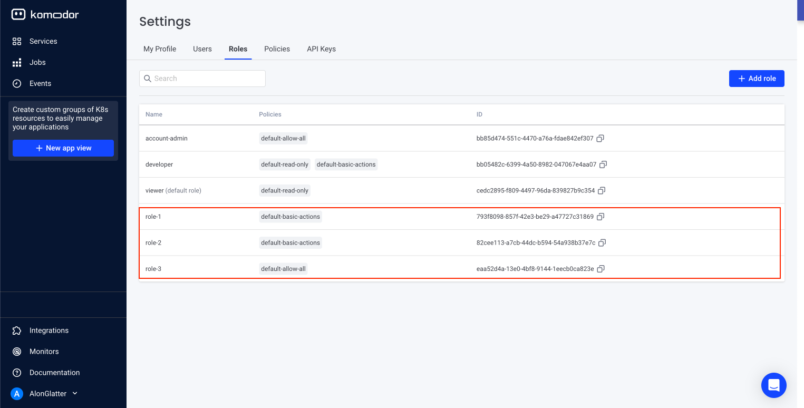

Note that for this example we have configured three custom roles, despite there already being default roles that are defined for every Komodor account.

 
For each role, there is a unique ID. We use those to create custom app roles in Azure AD.
Going back to the Azure Active Directory, we go to "App registrations":
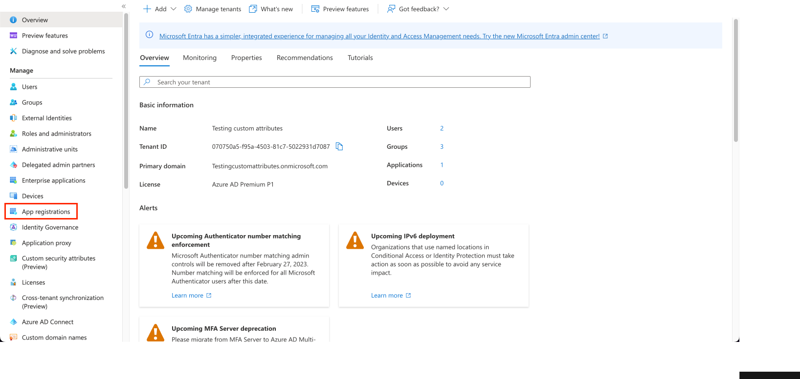

Pick "All applications", and then click the Komodor app:
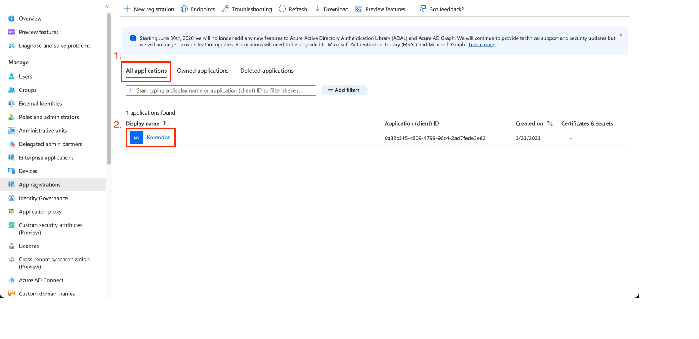

Next, navigate to "App roles":
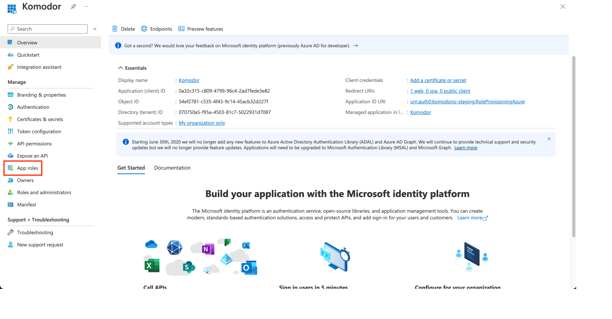

Click, "Create app role":
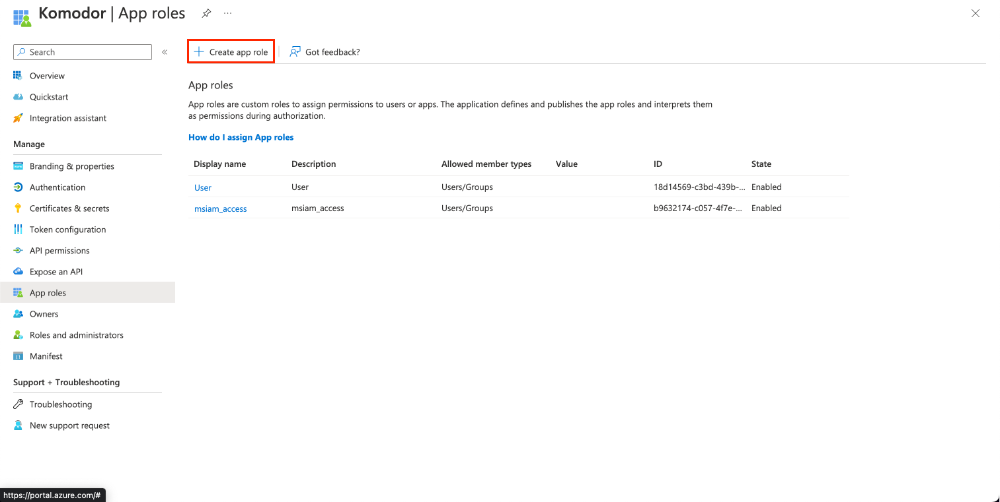

Fill in the form as below. Note that the value must be the ID as it appears in Komodor (seen above):
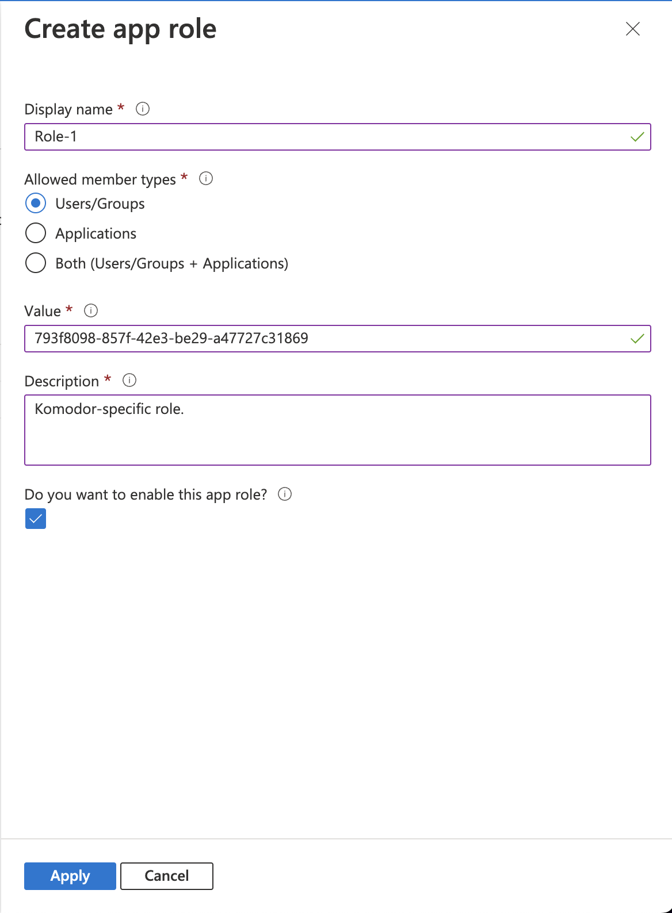

Finally, click "Apply". Repeat this for all the roles you wish to add, and you should see them added in the portal, like so:
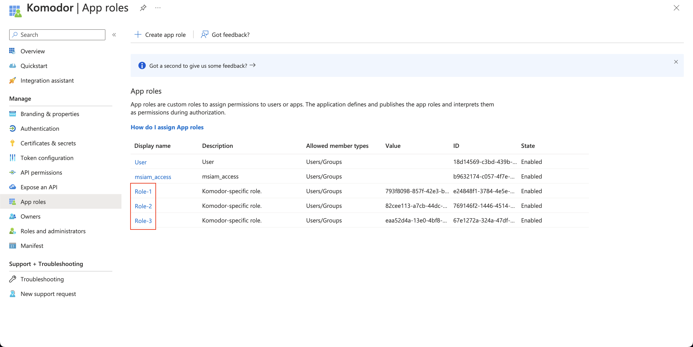

## Assigning Roles to a User

Now that we have created the Komodor app roles, we move on to assign them to a user.

Go back to "Enterprise applications" (explained above), and then pick the Komodor app:

Once there, we click on "Assign users and groups":
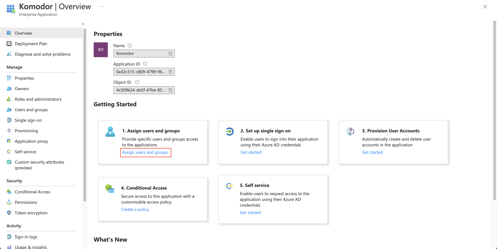

Click "Add user/group":

This will allow you to assign a role to a user (or a group, covered below). Simply pick a user:

Next, select a role:
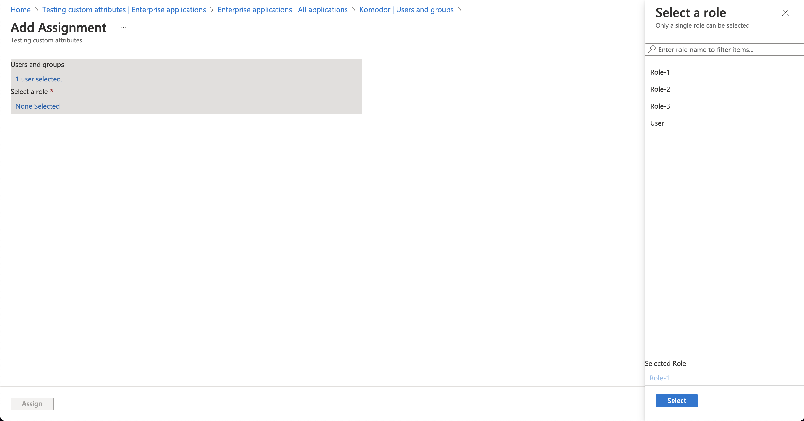

Finally, click "Assign".

## Assigning Roles to a Group

Just like we assigned a role to a user, we can assign a role to a group. To that end, we click "Add user/group", and simply pick a group rather than a user this time. We then select a role, and click "Assign".

Having done that, we should see the group with the role assigned to it (we can also see the user who was assigned a role above):

Note that members of groups automatically get assigned the roles that are assigned to some group. It means that since "Alon Glatter" is a member of "Group-1", he will be assigned both "Role-2" and "Role-1" (which was assigned to him via "Group-1").

## Sending Role Assignments Over SAML Response

Finally, having assigned roles to users (either directly, or via groups), we'd like to send those role IDs together with the SAML response that is returned when a user is authenticated upon logging into Komdoor.

This way, Komodor will know to automatically assign those roles to the user inside the Komodor app.

To do this, we go back to the "Single sign-on" page where we configured the SAML connection to Komodor (above), and click "Edit" on "Attributes & Claims":
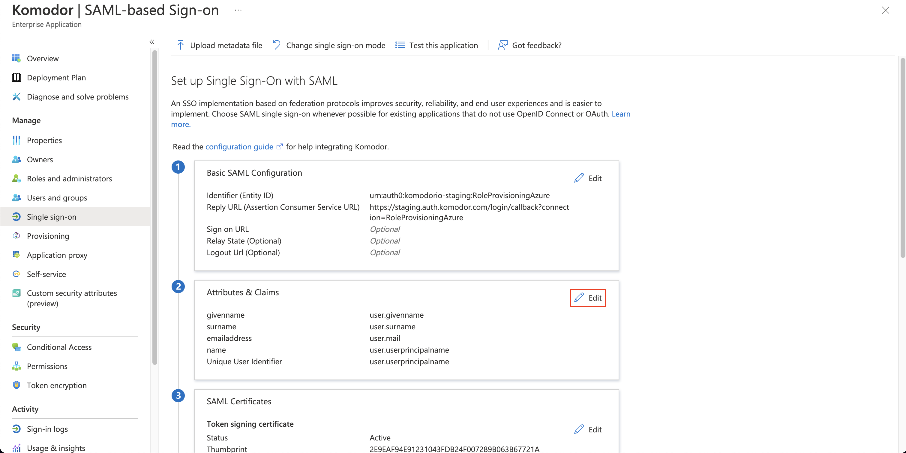

We click on "Add new claim":
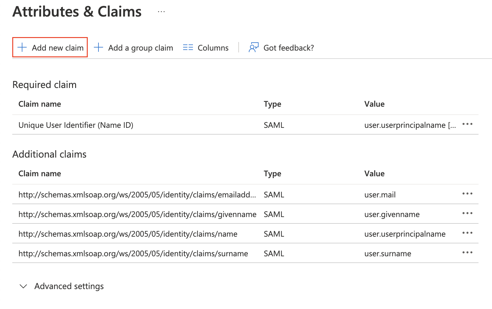

We then fill in the form like below, and then finally click "Save":

What will happen as a result is that every new SAML response that is sent upon user authentication will contain the attribute "komodorRoles", which the Komodor app expects to receive. This attribute will contain a list of all the values of the roles that are assigned to said user (i.e. the role IDs).

That's it! Next time the user logs in to Komodor via Azure AD, they will have been assigned the roles in Komodor which are respective to the roles they have been assigned in Azure.
