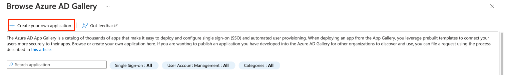
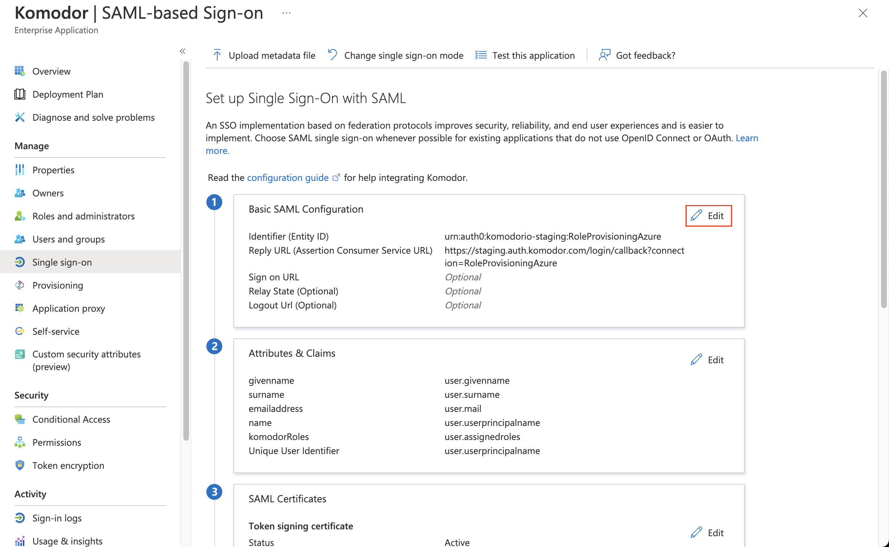

# Azure AD SSO (SAML)

> For the following part you need to contact Komodor support to receive the parameters Identifier and Reply URL (we specify below where they are needed).

Start by getting to the Azure Active Directory dashboard in the Azure portal.
From there, we navigate to "Enterprise applications":

Next, we click on "New application":

Then, click on "Create your own application":

Fill-in the application creation form as depicted below, and click "Create":

This should lead you to the following page, where we set up the SSO connection:

Pick SAML as your preferred SSO method:

This should lead you to the following page, where you click "Edit" on "Basic SAML Configuration":

This is where those parameters that are supplied by Komodor support (above) are required. We fill in the form as follows, and click "Save":

Next, we scroll down to the "SAML Certificates" section. We download the certificate file by clicking on the highlighted link.
Then, we copy the "Login URL" under the "Set up Komodor" section:

Both of those need to be sent to Komodor support to finish the setup for the SAML connection to Komodor.

Once the setup is done on both sides, you can click the "Test" button to test that the sign-in works.

