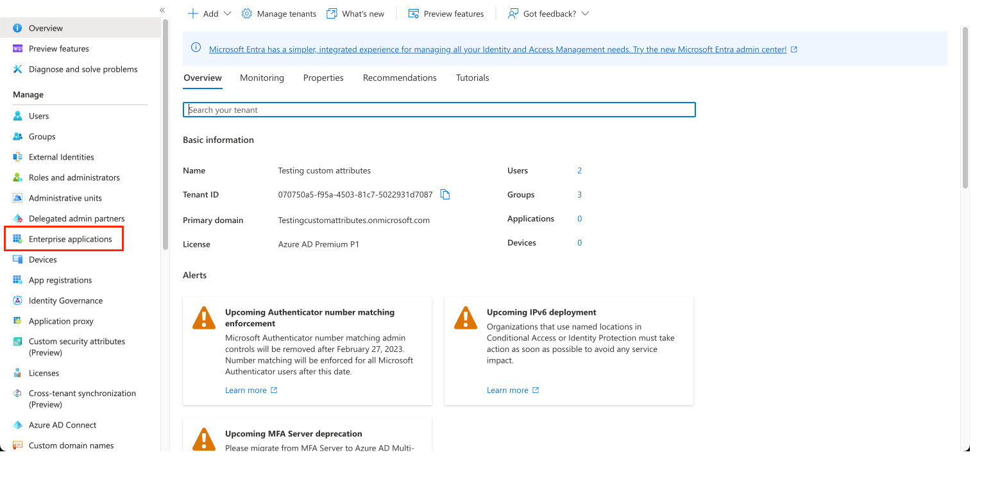
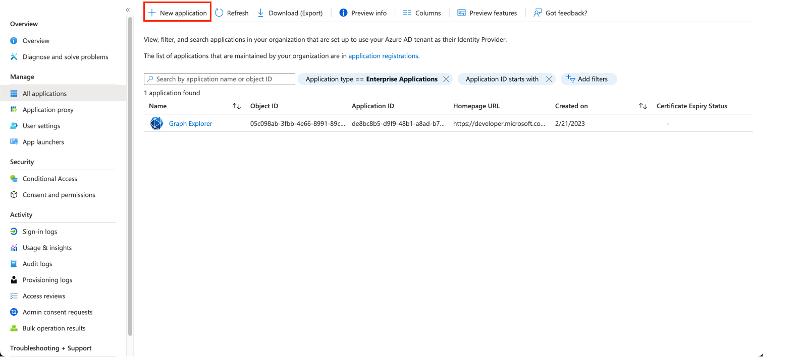
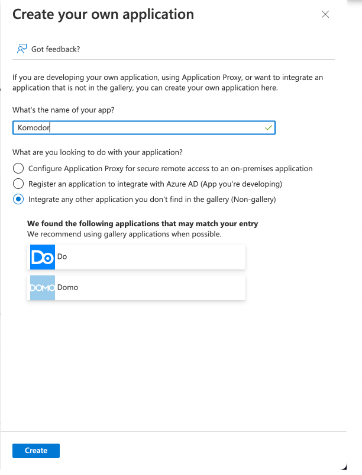
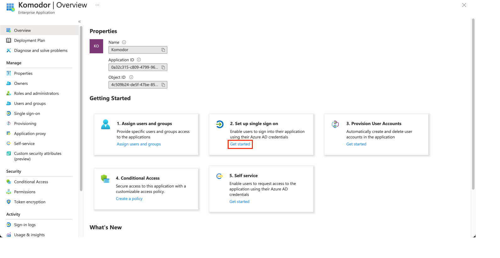
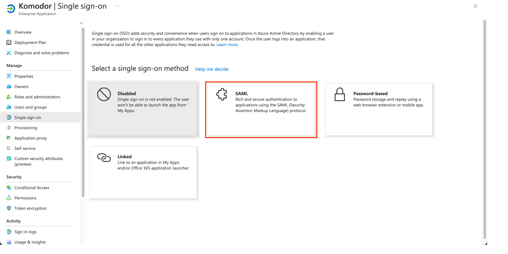

# Azure AD SSO (SAML)

Start by getting to the Azure Active Directory dashboard in the Azure portal.
From there, we navigate to "Enterprise applications":

Next, we click on "New application":

Subsequently, click on "Create your own application":

Fill-in the application creation form as depicted below, and click "Create":

This should lead you to the following page, where we set up the SSO connection:

Pick SAML as your preferred SSO method:

To finish the process, follow [this guide](https://community.auth0.com/t/setting-up-azure-ad-as-saml-enterprise-connection/87829).

> **_NOTE:_** This part should be consulted with Amit.
