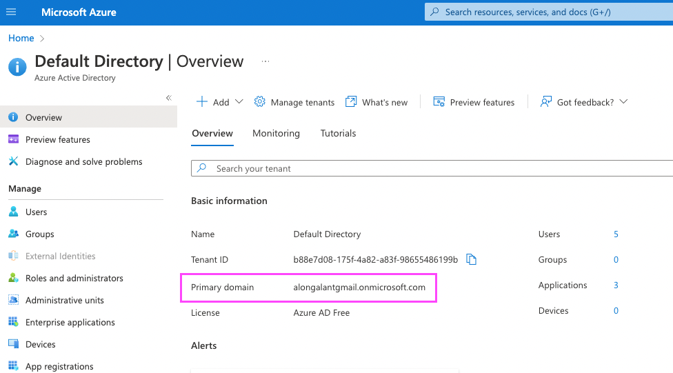
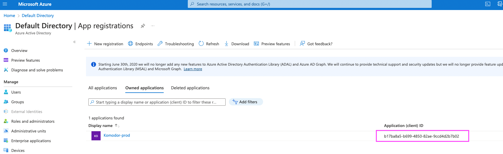

# Azure active directory

## Register Komodor App with the Microsoft identity platform

### Under **Manage**, select **App registrations** > **New registration**

- **Name:** Komodor
- **Supported account types:**
  - Accounts in any organizational directory (Any Azure AD directory - Multitenant)
- **Redirect URI:**
  - **Platform:** Web
  - **URL:** [https://auth.komodor.com/login/callback](https://auth.komodor.com/login/callback)
- Click on the `Register` button

### Create a Client secret

- Select **Certificates & secrets** > **Client secrets** > **New client secret**
  - **Description:** Komodor client secret
  - **Expires:** choose whatever right for you
  - Click on the `Add` button
  - **Once generated, copy its value and save it!** This secret value is *never displayed again* after you leave this page
  - Make sure to record the expiration date, you will need to renew the key before that day to avoid a service interruption

### Add permissions

- Select **API permissions** > **Add a permission > Microsoft APIs > Microsoft Graph**
- choose **Delegated permissions**
- Search **Directory**
- choose **Directory > Directory.Read.All**
- Click the `Add Premission` button

### Add another Redirect URIs

- Select **Authentication > WEB > Add URI**
- Add this url [https://komodorio.us.auth0.com/login/callback](https://komodorio.us.auth0.com/login/callback)
- Save

### Done! The Komodor app is registered  🌻

## Please send the next values to your contact at Komodor:

- **Microsoft Azure AD Domain**
  - Your Azure AD domain name. You can find this on your Azure AD directory's overview page in the Microsoft Azure portal.
  - 
- **Client ID**
  - Unique identifier for your registered Azure AD application. Enter the saved value of the **Application (client) ID** for the app you just registered in Azure AD.
  - 
- **Client Secret**
  - String used to gain access to your registered Azure AD application. Enter the saved value of the **Client secret** for the app you just registered in Azure AD.

### resources:

- [Auth0 tutorial](https://auth0.com/docs/authenticate/identity-providers/enterprise-identity-providers/azure-active-directory/v2?_ga=2.209803797.1637188949.1651998798-1042904470.1642416106&_gl=1*flhqna*rollup_ga*MTA0MjkwNDQ3MC4xNjQyNDE2MTA2*rollup_ga_F1G3E656YZ*MTY1MTk5ODc5Ny4xMy4wLjE2NTE5OTg3OTcuNjA.)
- [youtube](https://youtu.be/tV-2nQRFCio) (old Azure version but a really nice video)
