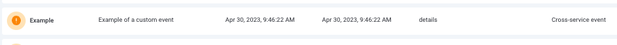
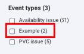
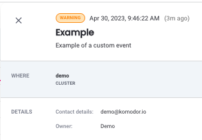

# Custom Events
Using an API call customers can enrich the Komodor timeline with their own custom events and correlate them to the relevant services

**Example events (UI)**  
Events list
  
Events page filters  
  
Custom event drawer  



## Prerequisites 
- [API key](https://docs.komodor.com/Learn/Create-API-Token.html)

*Please note*: This feature is only available for paying/trial users

## Using the API

`curl --location 'https://api.komodor.com/mgmt/v1/events' \  `  
`--header 'x-api-key: <TOKEN> \  `  
`--header 'Content-Type: application/json' \  `   
`--data-raw <BODY>`  

Replace the <TOKEN> with the token you've generated and the <BODY> with the event content as described below

### Body 
```
{
    "eventType": "string", 
    "summary": "string", 
    "scope": { 
        "clusters": ["string"],
        "servicesNames": ["string"], 
        "namespaces": ["string"]
    }, 
    "severity": "warning", 
    "details": { 
        "key": "val",
        "key2": "val2"
        ...
    } 
}
```

| Field              	| Type                                  	| Description                                                                    	|
|--------------------	|---------------------------------------	|--------------------------------------------------------------------------------	|
| eventType          	| String                                	| **Required**, the type of event you'd like to create, limited to 60 chars          	|
| summary            	| String                                	| **Required**, descipription of the event                                           	|
| scope.clusters     	| List<String>                          	| **Optional**                                                                       	|
| scope.serviceNames 	| List<String>                          	| **Optional**                                                                       	|
| scope.namespaces   	| List<String>                          	| **Optional**                                                                       	|
| severity           	| Enum - Info (**default**), Warning, Error 	| **Optional**                                                                       	|
| details            	| Object (key:value pairs)              	| **Optional**, key:value pairs allowing specifying any additonal categories of data 	|

#### Scope 
The scope field allows the user to define the Services to associate the custom event with.

By default, when no scope is specified, the event will be correlated to all Services on the account level. when specifying a cluster/namespace/service name you are narrowing the scope accordingly (within a specific scope field (e.g - cluster, namespaces, serviceNames) there is an OR condition, between the fields its AND).  

**Examples:**   
Let's assume the following scenario: we run 2 clusters, A and B, in those we have 2 namespaces, C and D, in each of those namespaces we have 5 Services, numbered from 1-5. In total we have 20 Services in those clusters.

- By specifying no scope at all - the event will be correlated to all 20 Services  
- By specifying just cluster A - the event will be correlated to all the services (10) running in cluster A  
- By specifying namespace C - the event will be correlated to all services running in namespace C (within both clusters)   
- By specfiying services 1, 2, 3 - the event will be correlated to all services with names 1 or 2 or 3
- By specifying a combiniation of cluster B namespace D - the event will be correlated to all the services running in namespace D on cluster B
- By specifying a combination of namespace C and service 5 - the event will be correlated to service 5 running on namespace C on both clusters
