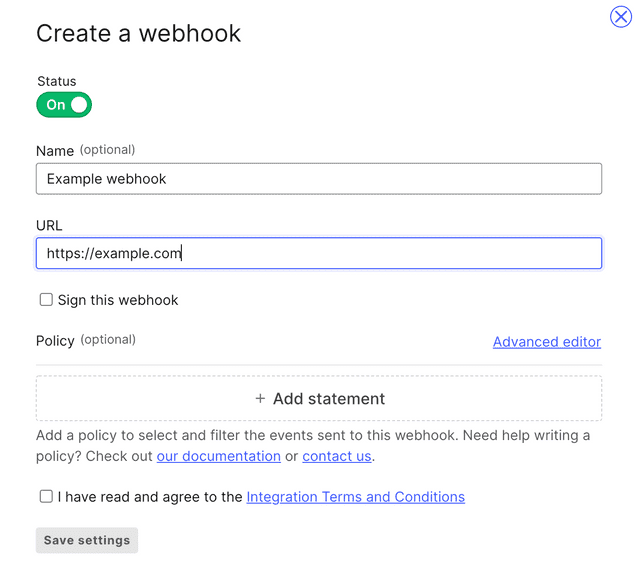

# LaunchDarkly Integration

Integration with LaunchDarkly extends the holistic view of the environment with flag changes.

For example:

- Feature flag was turned on
- Feature flag in variation changed
- Feature flag targeting was changed

## Installation

In order to create the integration, navigate to [LaunchDarkly Webhook Integration](https://app.launchdarkly.com/default/integrations/webhooks/new) and fill in the form:

1. Name - give your integration a name.
2. URL - __Please contact us to provide you the URL__ (we also will provide you a secret to sign the webhooks payload).
3. Sign the Webhook - use the secret from Komodor.
4. Add policy
   1. You can use the following statement to tell LaunchDarkly to send to Komodor all the changes for all your flags across all your environments. You may use the "Resource finder" to customize it for your needs.
         ```commandline
         proj/*:env/*:flag/*
         ```
      1. Set the effect to "**Allow**"
      2. Choose all actions
      3. Click "**Update**"
      4. Check "**I have read and agree to the Integration Terms and Conditions**"
      5. Click "**Save Settings**" to finish the integration.


