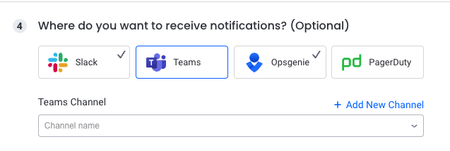

# Microsoft Teams Integration

The Teams integration allows you to be notified on issues triggered by Komodor [Monitors](https://app.komodr.com/com/main/monitors).

##  Configuring Teams Notifications

###  Configuration Steps

1. Open up the Komodor [Monitors page](https://app.komodor.com/main/monitors). 
2. Select the Cluster
3. Select the Monitor type
4. Create/modify Monitor rule, configure it's trigger conditions, the scope on which you'd like to be notified on and specify the Teams channel you want the notification to be sent to.
5. On your first use, you will have to configure a Teams channel, to do so, click on "Add New Channel" and follow the guide provided in the UI

6. Save the rule