# Okta Role Provsionining 

## Setup
To facilitate the assignment of Komodor roles via Okta we first need to configure a few things on the organization Okta account.

### Configure a custom attribute
- Navigate to the Profile Editor section under Directory   
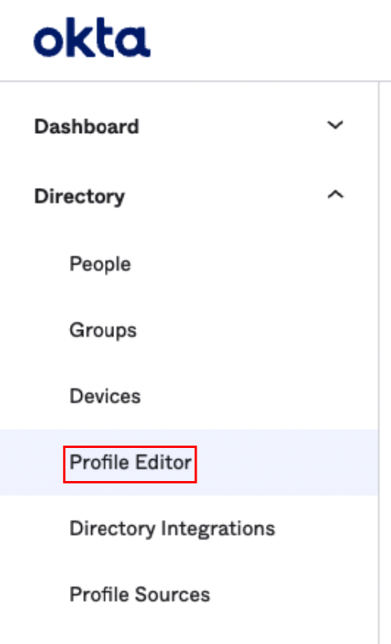  

- Select the Komodor User profile  
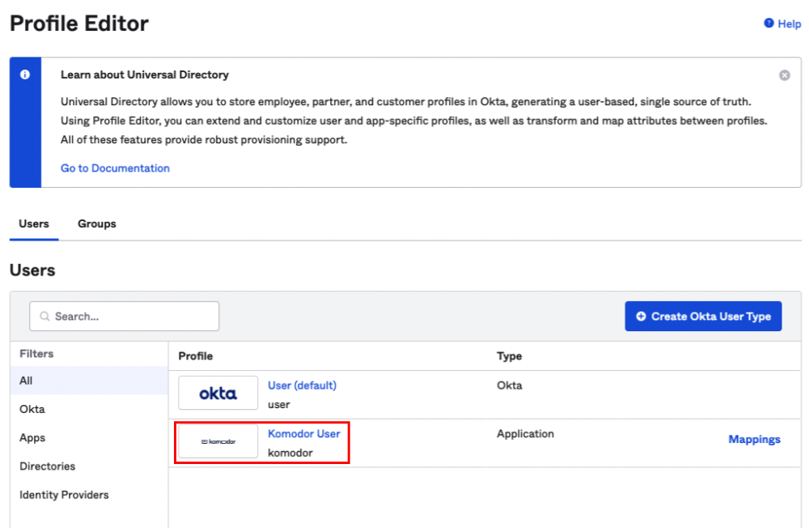

- Select the + Add Attribute button
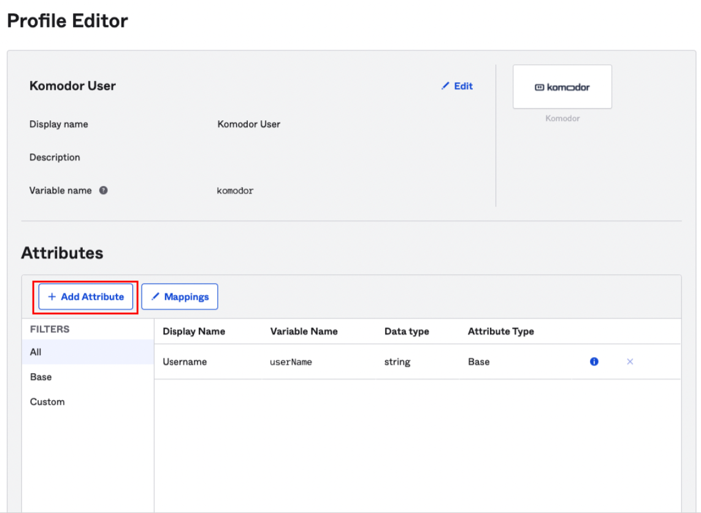

- Fill in the form as specified in the image below and save the changes
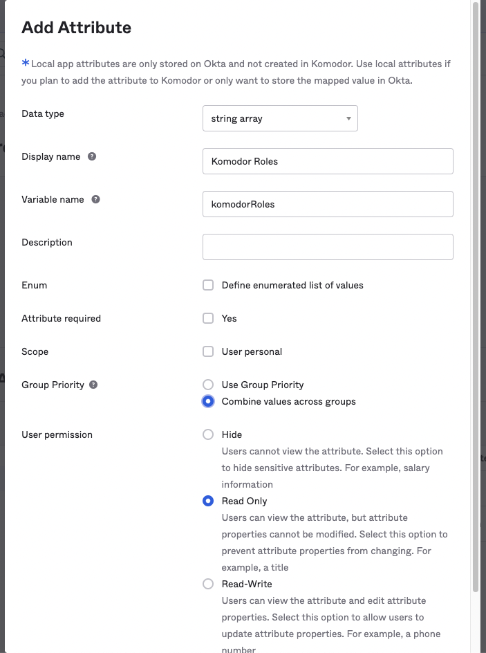

- To complete the process, go to the Applications view  
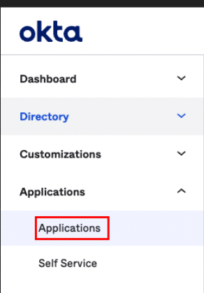

- Select the Komodor / Komodorio app
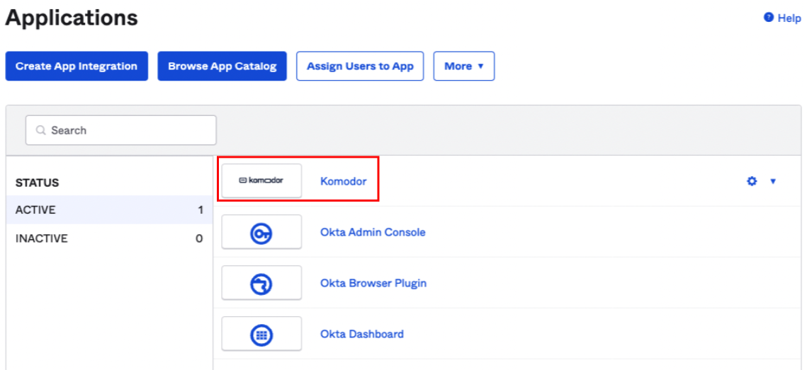

- Navigate to the Sign On tab
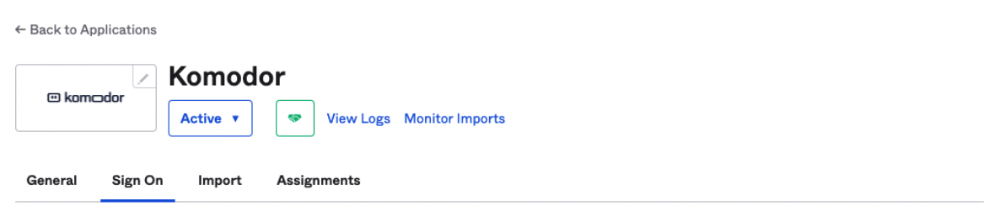

- Under the Settings section, click the Edit button, under the SAML 2.0 section open the Attributes (Optional) section
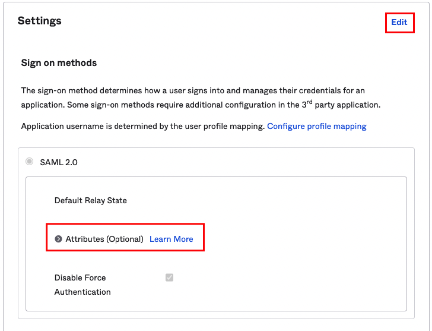

- Add the following attribute and save the changes
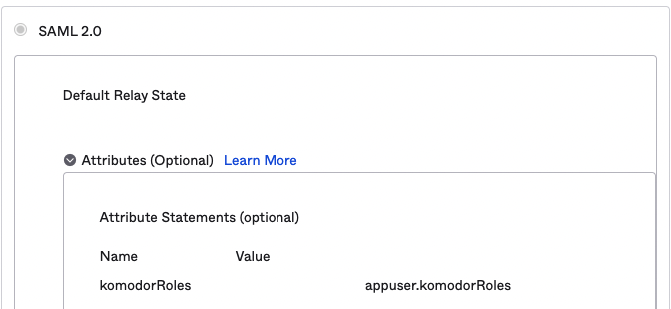

- Everything is now set to assign Komodor roles through Okta

## Adding Roles to a User
- Navigate to the People section  
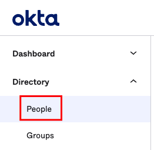

- Select the user you'd like to assign roles to
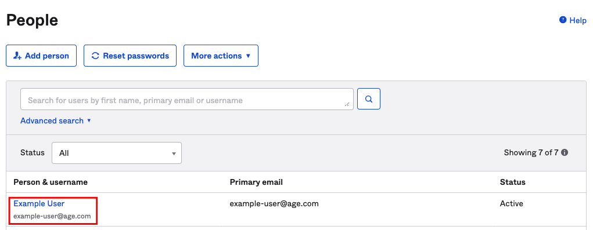

- In case the Komodor / Komodorio application is not yet assigned to the user: 
    - Click Assign Applications
    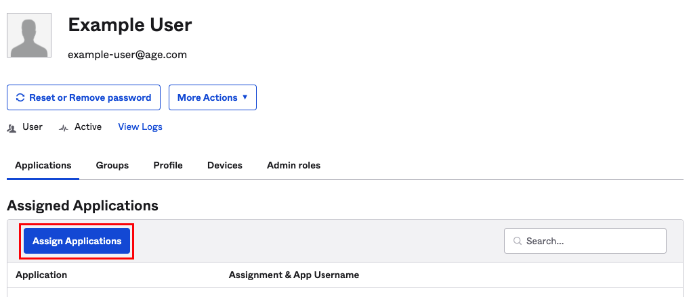

    - Assign the Komodor / Komodorio application to the user
    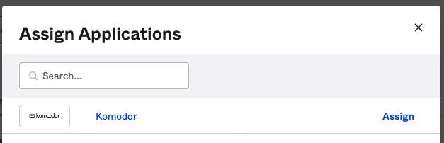

    - Add the relevant roles you'd like to assign to the user and save the changes
    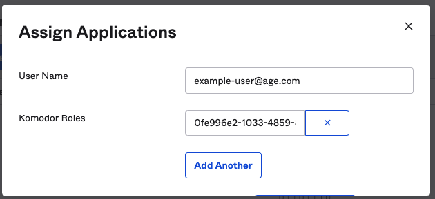

- If the Komodor / Komodorio application is already assigned to the user:
    - Edit the Komodor / Komodorio application assignment 
    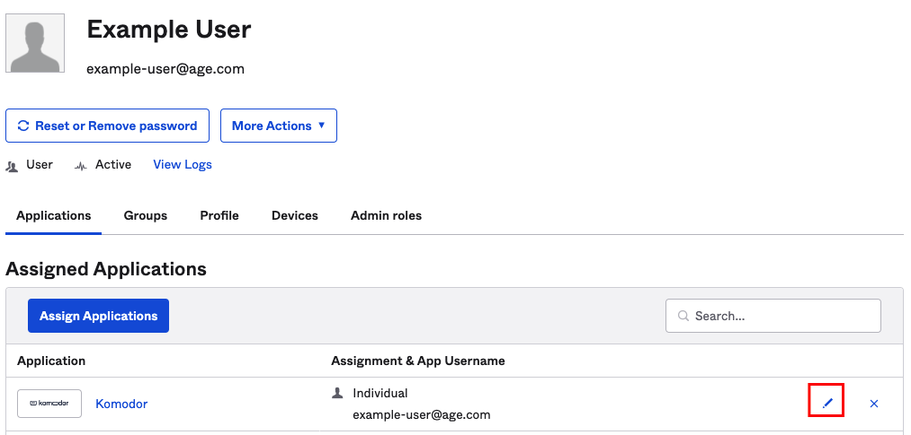

    - Make the wanted changes and click Save
    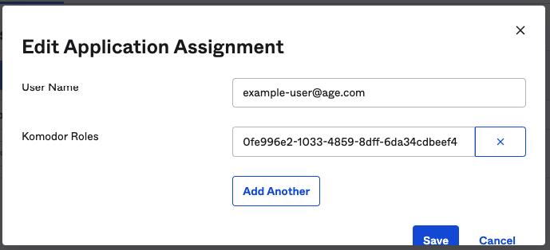

## Adding Roles to a Group
- Navigate to the groups section  
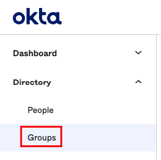

- Select the group that you'd like to assign the Komodor app to
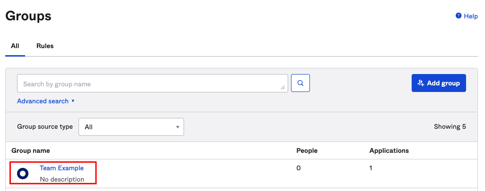

- Navigate to the Applications tab
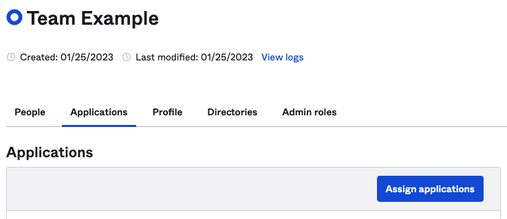

- Click the Assign applications button and Assign the Komodor / Komodorio app
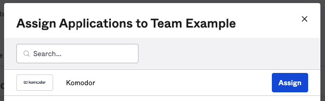

- Specify the Roles you'd wish to assign the group with and Save the assignment
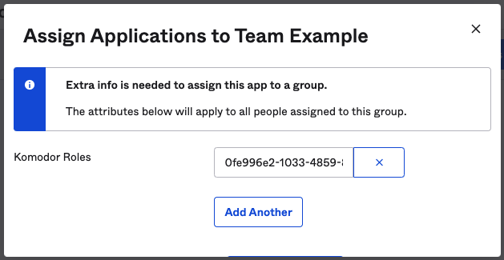

### Edit Role Assignent on an existing group
- Go the the relevant group Applications tab and edit the Komodor / Komodorio application assignment  
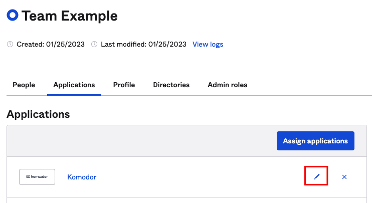

- Modify the assigned role ids and save the changes
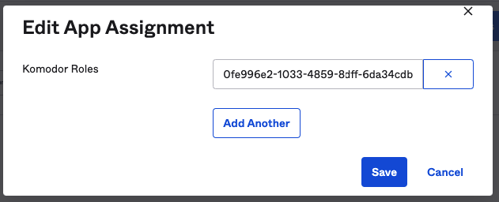

### Adding Members to a Group
- Navigate to the groups section  

- Click the Assign people button  
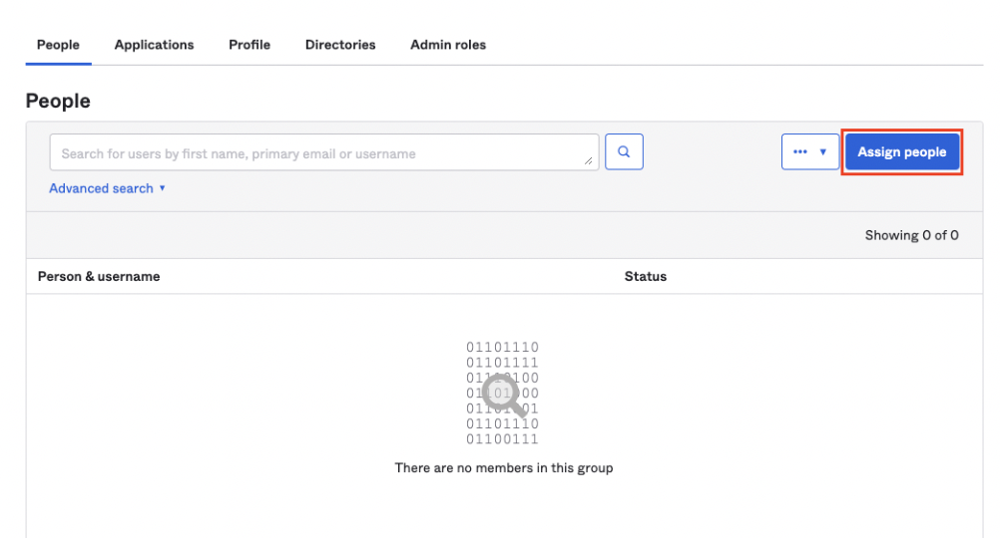

- Click the + button for each user you'd like to add to the group. Click Done at the end   
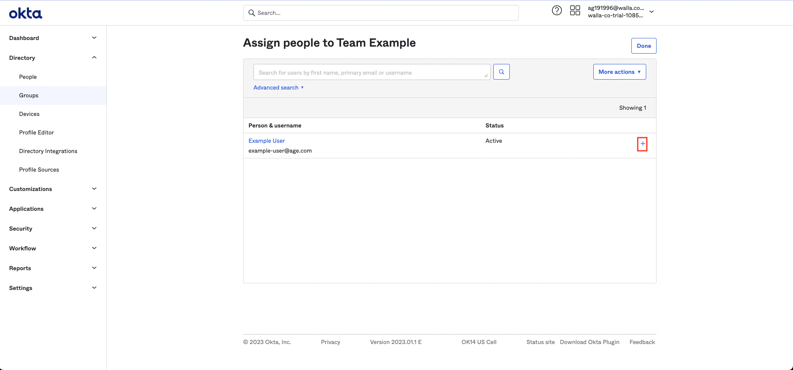

- Navigate to the Applications section  

- Select the Komodor application and navigate to the Assignments tab  
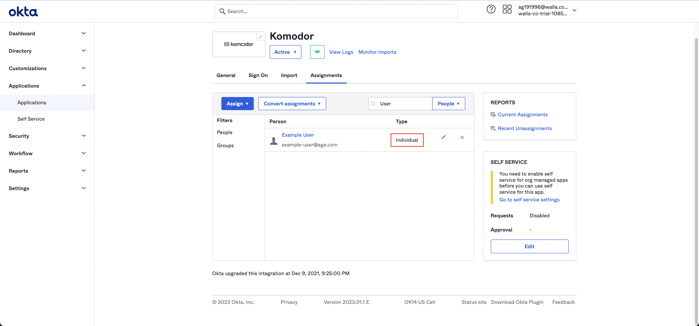

**Please note:** The Type of the assignment defines whether the Individual or Group roles will take over. 

- To convert the assignment type from Individual to Group, click Convert assignments button   
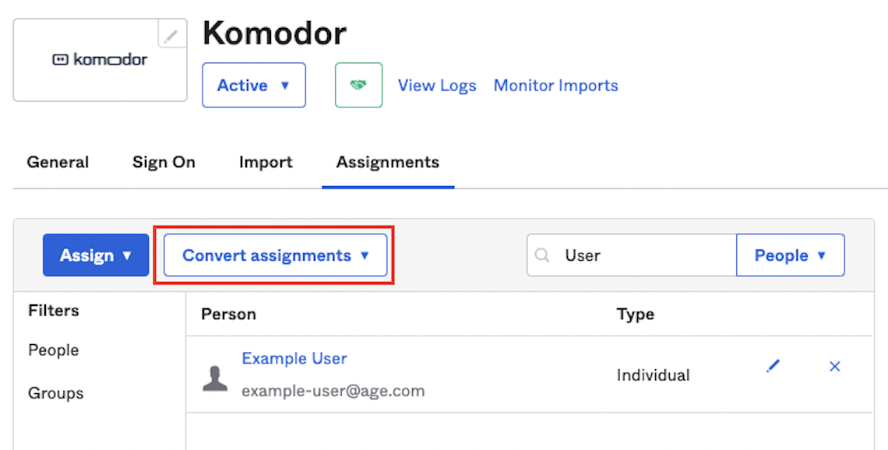

- Select the users for whom you'd like to convert the assignment, and click Convert selected (alternatively you can click the Convert all assignments button) 
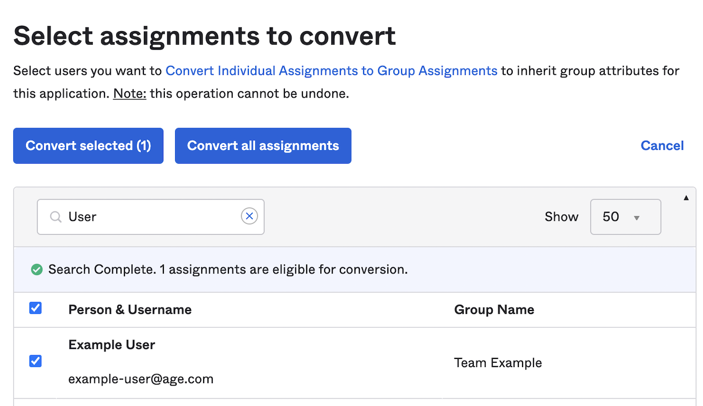

- Going back to the previous screen, you can confirm that the assignment type has changed  

