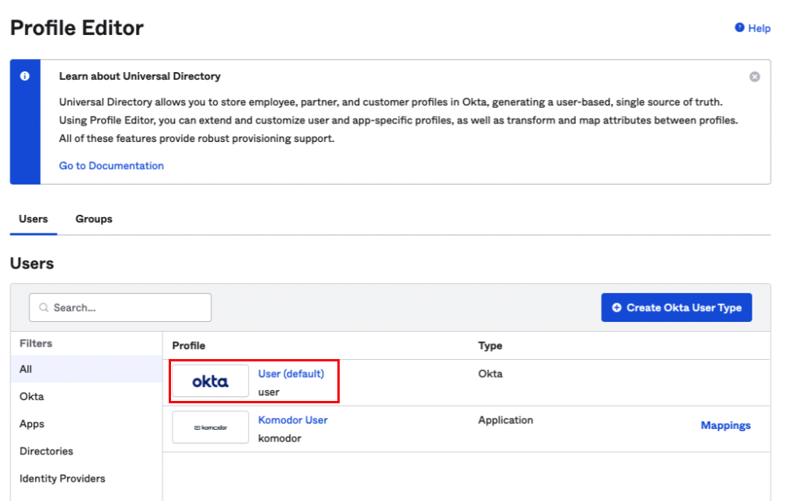
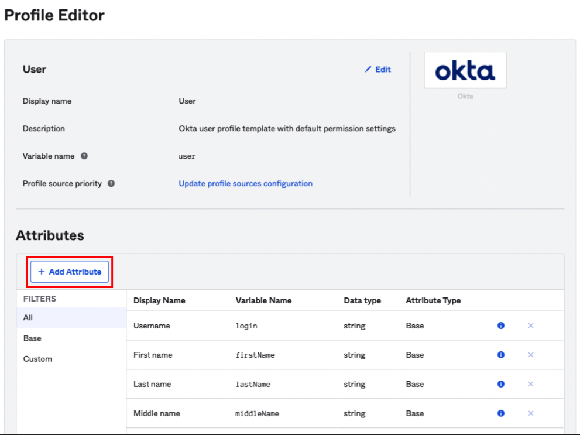
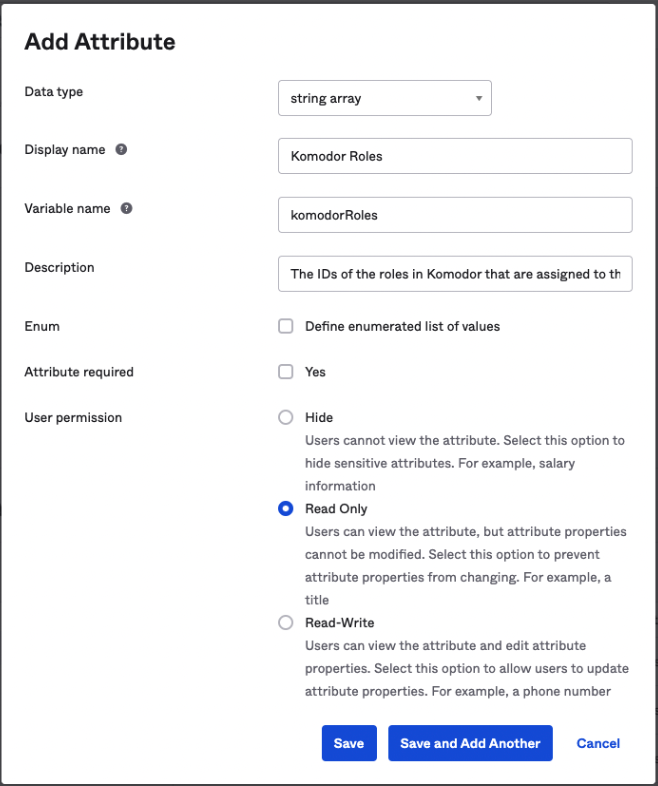
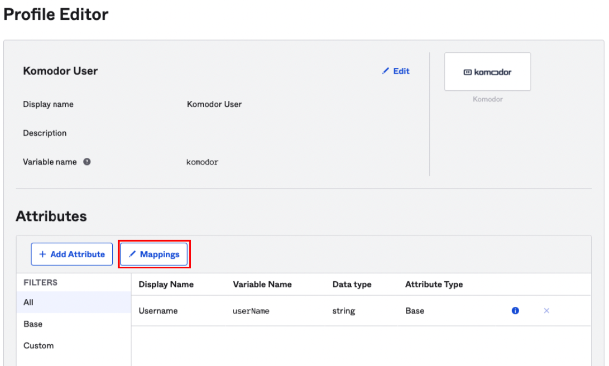
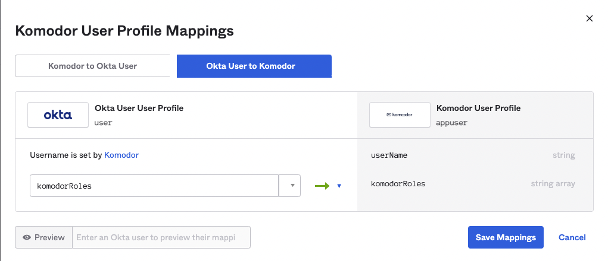

# Okta Role Provsionining 

## Setup
To facilitate the assignment of Komodor roles via Okta we first need to configure a few things on the organization Okta account.

### Configure a custom attribute
- Navigate to the Profile Editor section under Directory   
  

- Select the User (default) profile  

- Click the + Add Attribute button

- Fill in the form as specified in the image below and save the changes. Note that while the variable name should remain `komodorRoles`, the description can be anything you choose.

- We now need to add the same attribtue to the Komodor User profile, return to the Profile Editor page and select the Komodor User profile  

- Select the + Add Attribute button

- Fill in the form as specified in the image below and save the changes

- Now we'll create the mapping between those attributes. Under the Komodor User profile, click the Mappings button  

- In the Komodor User Profile Mappings modal, select the Okta User to Komodor tab and create the mapping as seen in the image below and click Save Mappings

- To complete the mapping process, go to the Applications view  

- Select the Komodor / Komodorio app

- Navigate to the Sign On tab

- Under the Settings section, click the Edit button, under the SAML 2.0 section open the Attributes (Optional) section

- Add the following attribute and save the changes

- Everything is now set to assign Komodor roles through Okta

## Adding a Role/s to a User
- Navigate to the People section 

- Select the user you'd like to assign roles to

- In case the Komodor / Komodorio application is not yet assigned to the user: 
    - Click Assign Applications
    

    - Assign the Komodor / Komodorio application to the user
    

    - Add the relevant roles you'd like to assign to the user and save the changes
    

- If the Komodor / Komodorio application is already assigned to the user:
    - Edit the Komodor / Komodorio application assignment 
    

    - Make the wanted changes and click Save
    

## Adding Role/s to a Group
- Navigate to the groups section  

- Select the group that you'd like to assign the Komodor app to

- Navigate to the Applications tab

- Click the Assign applications button and Assign the Komodor / Komodorio app

- Specify the Roles you'd wish to assign the group with and Save the assignment

### Edit Role Assignent on an existing group
- Go the the relevant group Applications tab and edit the Komodor / Komodorio application assignment  

- Modify the assigned role ids and save the changes

**Please note:** Group role assignment overrides the user role assignment, meaning - if a user is assigned to a group with configured roles, it'll override any role configuration on the user level.