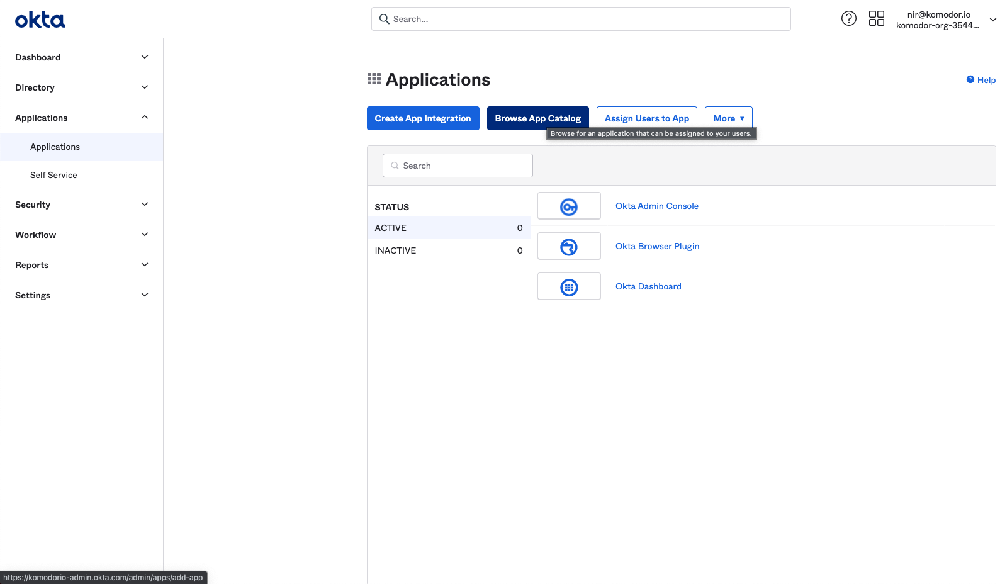
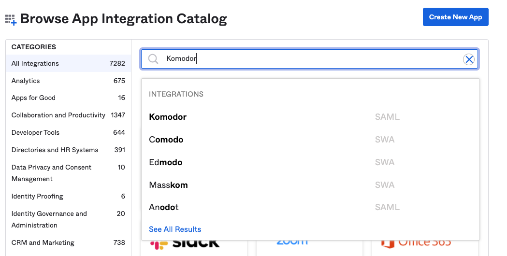
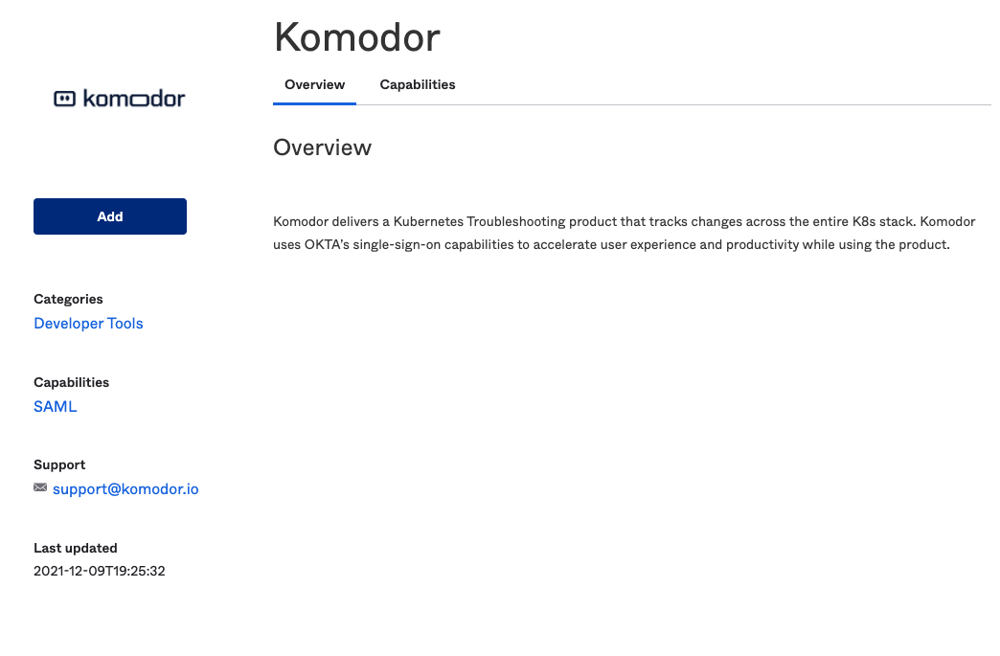
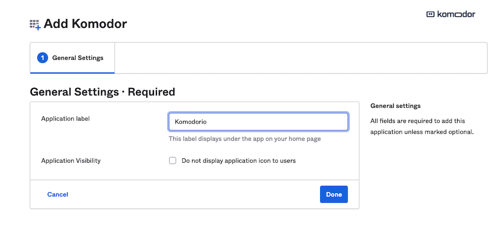
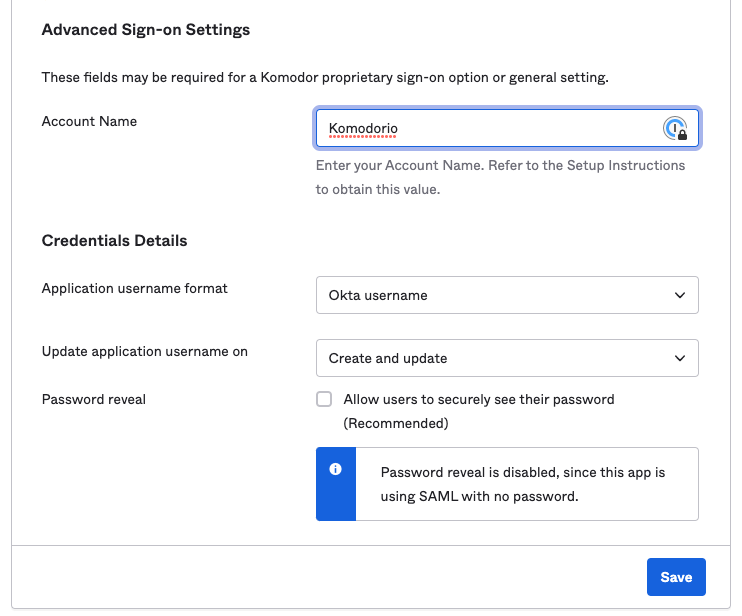
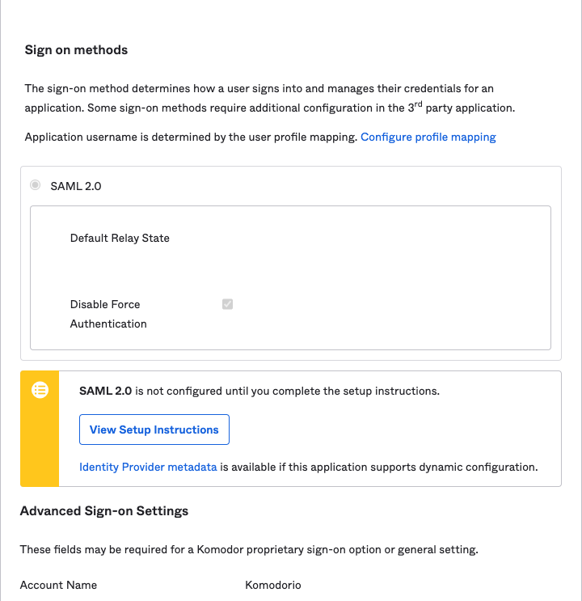
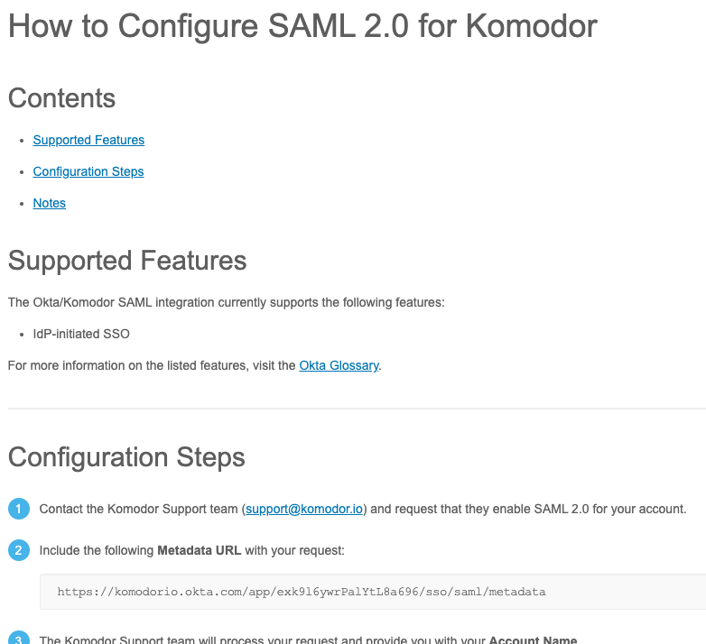

# Okta Integration

Use Okta's deep, pre-built integrations to securely connect to Komodor.

Note: Only Okta administrators can add the Komodor application, if you aren't an Okta administrator, please contact your Okta administrator to the application added.

Follow these steps to integrate Komodor with Okta:

1. Go to Okta Admin -> Applications -> Browse App Catalog
   

2. Search for "Komodor".
   

3. Then click 'Add'.
   

4. Enter any application label you want in 'Application Label'. This is for internal use only and will also be the nickname for the Application.
   

5. Go to application -> 'Sign On' tab -> 'Settings' and click 'Edit'.

6. In 'Advanced Sign-on settings' enter variable of 'Account Name' and pass this variable to us, for example: 'Komodorio'.
   

7. Click 'View Setup Instructions'.
   

8. Send the 'Metadata URL' and Account Name variable to support@komodor.com to complete the Okta setup.
   

9. Once Customer Success has comepleted the setup you can begin to use Okta for SSO.
