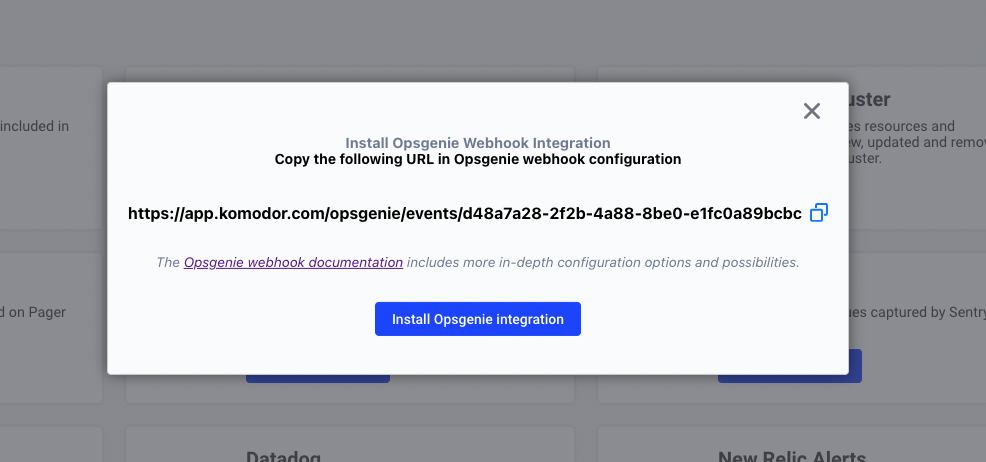

# Opsgenie Integration

Opsgenie integration allows Opsgenie Monitor Alerts to be available in Komodor timelines.

---

## Installation

### The Alert Manager integration involves 3 steps:

1. Enabling the integration in Komodor.
2. Creating webhook for the alert manager.
3. Adding labels to the alert.

---

### 1. Enabling the integration in Komodor

To enable the Komodor Prometheus Alert Manager integration go to [Komodor integrations page](https://app.komodor.com/main/integration), select Opsgenie and install the integration.

### 2. Configure alerts from Opsgenie

Use the url provided in the installation step to create an Opsgenie [webhook](https://support.atlassian.com/opsgenie/docs/integrate-opsgenie-with-webhook/). 


### 3. Adding labels to the alert.

To relate the alert to the relevant workload and make the alerts visible on workloads timelines - adding labels to alerts is required. Each alert without a label will be added to the system without mapping to a specific service.

Add labels to the alerts [extra properties](https://support.atlassian.com/opsgenie/docs/alert-fields/) to connect the alert event to the appropriate resource. 

```yaml
<label_name>: <label_value>
```
