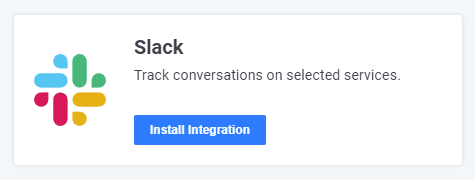
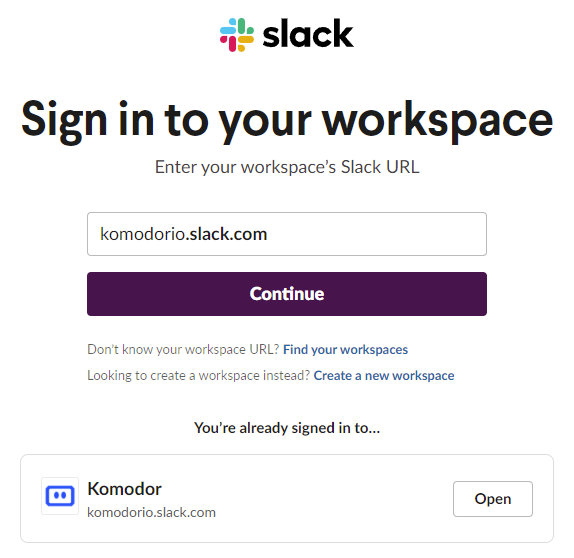
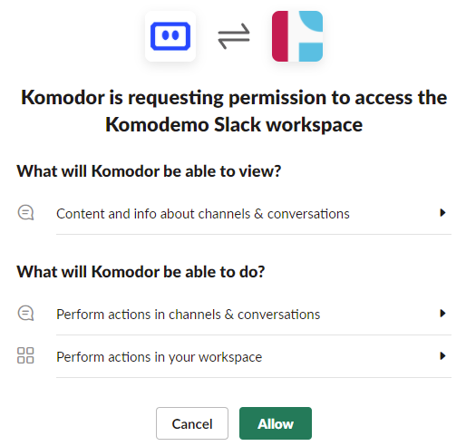

# Slack Integration

## Overview

The Slack integration allows you to recieve notification for events such as successfull or failed deployments, service health state changes, and triggered Workflows from Komodor to a Slack channel. Komodor supports different granularity levels, Cluster, Namespace and Service for each notification. The notification type, destination, and granularity can be defined in the Komodor Notifications screen.

### Requirements
Depending on your companies Slack settings a company admin may be required to enable the integration, the same user will need to be a Komodor Admin in order to start the installation from the Komodor integration page.

!!! Note The free version of Slack is limited to 10 applications.

### Installation

1. Once logged into the Komodor platform click on the [_Integrations_][3] tab.
2. Locate the Slack integration under the _Avaiable Integrations_ section and click on _Install Integration_ to start, this will forward you to the Slack Workspace login page.
<figure>
    
</figure>
3. You might be prompted to login to your Slack workspace, if so login and and click _Continue_.
<figure>
    
</figure>
4. Click on _Allow_ to complete the Slack integration.
<figure>
    
</figure>
5. Once completed you will be forwarded back to the Komodor Integration page where you will find the Slack integration listed under the _Installed Integrations_.

### Creating notifications
To enable per service or deployment notifications you may either use the [Notifications][1] tab in the UI or create them using [deployment annotations][2].

[1]: https://app.komodor.com/main/notifications
[2]: https://docs.komodor.com/Learn/Annotations.html#notifications
[3]: https://app.komodor.com/main/integration