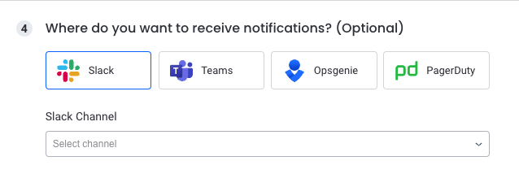

# Slack Integration

## Overview

The Slack integration allows you to be notified on issues triggered by Komodor [Monitors](https://app.komodr.com/com/main/monitors).

## Requirements
Depending on your companies Slack settings a company admin may be required to enable the integration, the same user will need to be a Komodor Admin in order to start the installation from the Komodor integration page.

!!! Note The free version of Slack is limited to 10 applications.

## Installation

1. Once logged into the Komodor platform click on the [_Integrations_][3] tab.
2. Locate the Slack integration under the _Avaiable Integrations_ section and click on _Install Integration_ to start, this will forward you to the Slack Workspace login page.
<figure>
    
</figure>
3. You might be prompted to login to your Slack workspace, if so login and and click _Continue_.
<figure>
    
</figure>
4. Click on _Allow_ to complete the Slack integration.
<figure>
    
</figure>
5. Once completed you will be forwarded back to the Komodor Integration page where you will find the Slack integration listed under the _Installed Integrations_.

## Creating notifications
To enable notifications use the [Monitors][1] tab in the UI 

1. Open up the Komodor [Monitors page](https://app.komodor.com/main/monitors). 
2. Select the Cluster
3. Select the Monitor type
4. Create/modify Monitor rule, configure it's trigger conditions, the scope on which you'd like to be notified on and specify the Slack channel you want the notification to be sent to.

5. Save the rule

[1]: https://app.komodor.com/main/monitors
[3]: https://app.komodor.com/main/integration