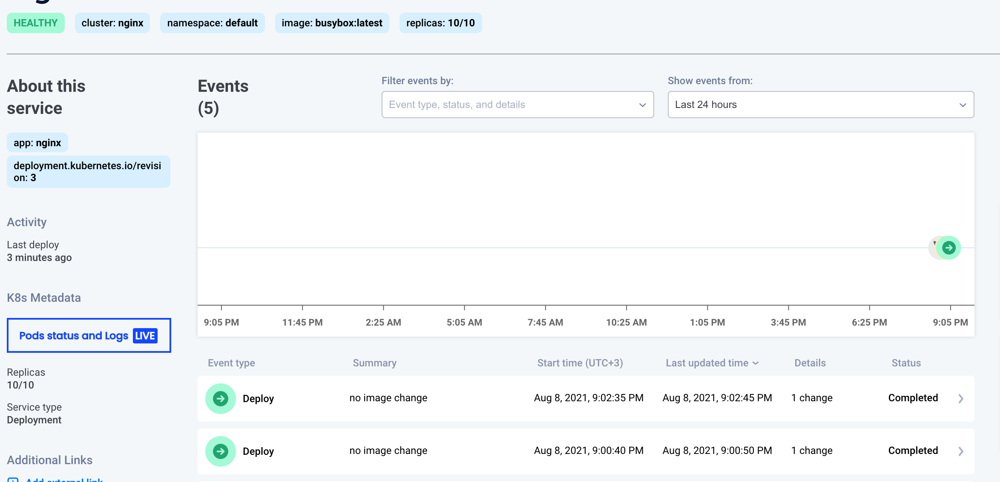

# Interaction with the Cluster

Interaction with the cluster allows you to speed up the troubleshooting process. This is done by asking Komodor's agent to perform actions in the cluster.

!!! note ""
    Komodor does not run any actions that are not initiated by one of the users in the account

## Prerequisites
Install Komodor's watcher (version `<0.1.44`) with `--set watcher.enableAgentTaskExecution=true` to enable interaction with the Cluster.

### Upgrade
```bash
helm upgrade --install k8s-watcher komodorio/k8s-watcher --set watcher.enableAgentTaskExecution=true --reuse-values
```

## Live Pods
In the service, click on the `Pod Status and Logs` button.



The table shows all the pods that belong to the service based on the pod owner controller.


## Actions

### Pod Logs
Request logs from one of the pods will stream back the last 100 logs from the pod.


When a pod was previously restarted by Kubernetes you can see the logs just before the pod was restarted.


### Pod Description
Request returns the same output as `kubectl describe pod [NAME]`
