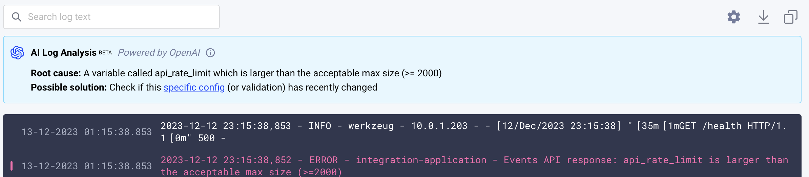
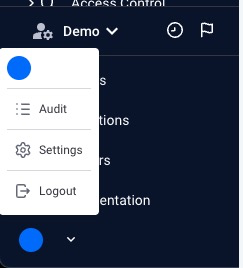

# AI Log Analysis

## Intro

The "AI Log Analysis" feature in Komodor designed to simplify the process of analyzing pod logs within your application environment. 
Leveraging technology based on OpenAI, this feature helps users efficiently sift through extensive log lines, identify potential root causes of issues, and recommend possible solutions.

  

## Pre-requisites

Komodor Admin should enable this feature.

1. Go to **settings** in the user’s dropdown

  

2. In “Features” section, look for “AI Log Analysis” and click **“Enable”**

  

**Please note**:  
- This feature will become usable by **all users** in your account
- Logs will be sent to OpenAI as-is for analysis, and therefore OpenAI’s [privacy policy](https://openai.com/policies/privacy-policy) applies
- Only account admins may enable or disable this feature (Consent form)

## How it works?

On any logs view, the AI Log Analysis feature will appear, allowing you to send your logs for AI analysis process, trying to find the root cause and suggested solution.

**Please note**:  
Due to OpenAI token limits, this response is based on the last 50 lines in the log.

#### Log analysis for availability issues
Whenever you click on “investigate” for availability issues that have logs collected - we automatically send those logs for analysis and the output will be in “Container Logs” step on top of the logs area.

  

#### Log analysis for any pod
Whenever you are viewing pod logs on any view - service view/node’s pods etc.. You’ll see the AI Log Analysis component on top of the logs area. 
Just click **“Analyze now”** for results.

  
