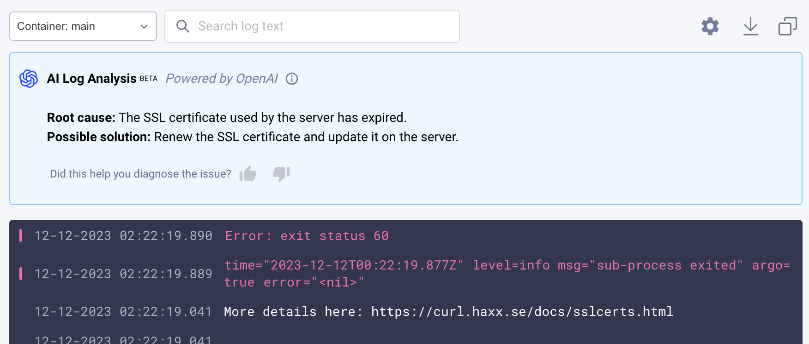
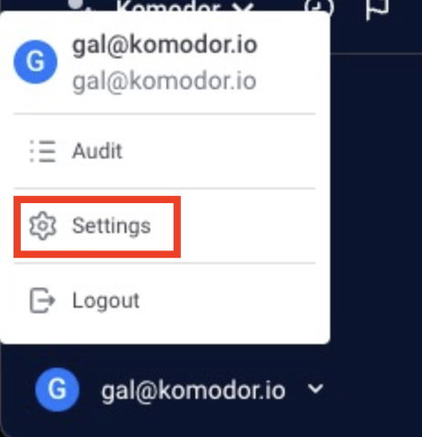
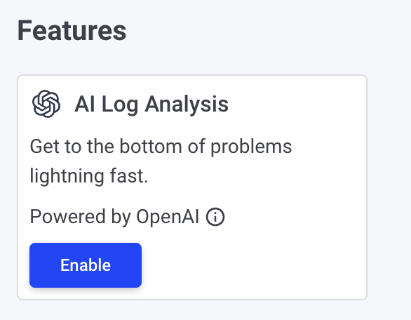
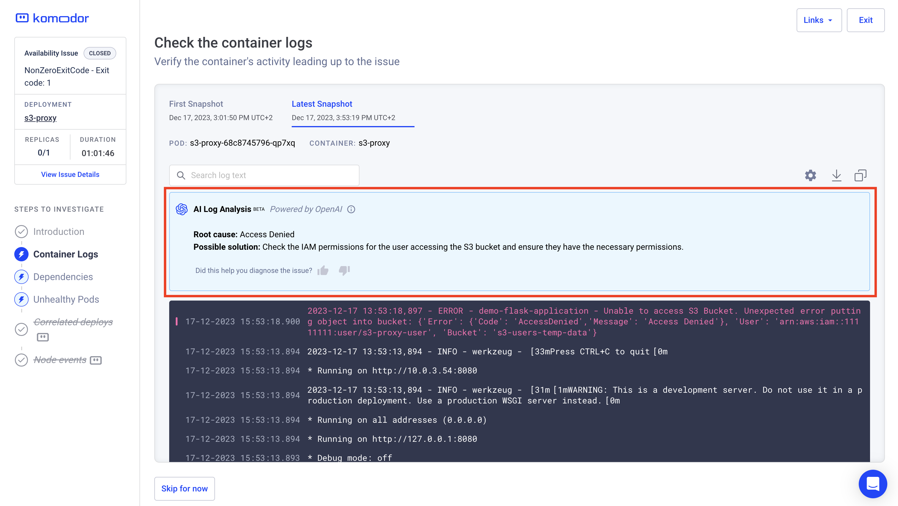
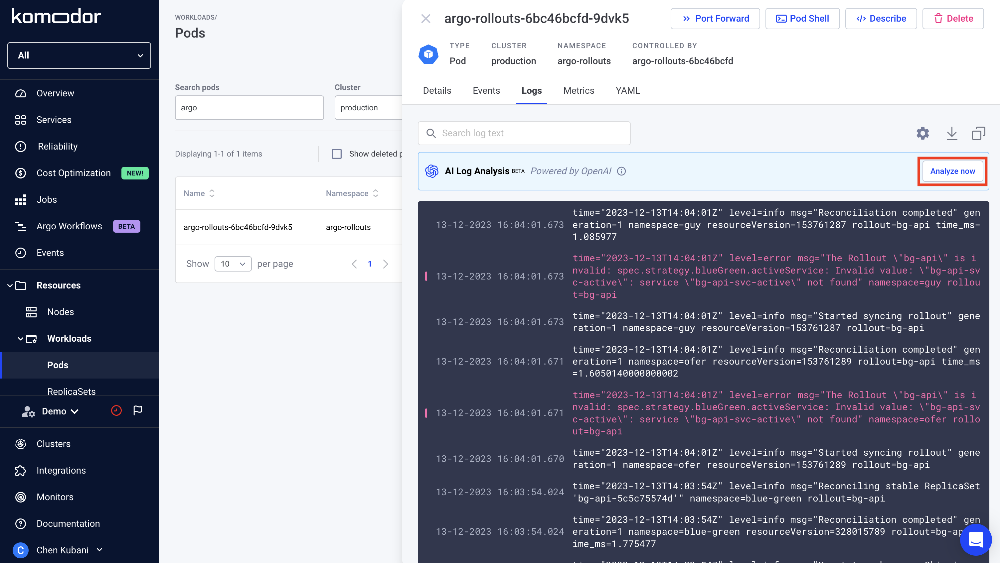
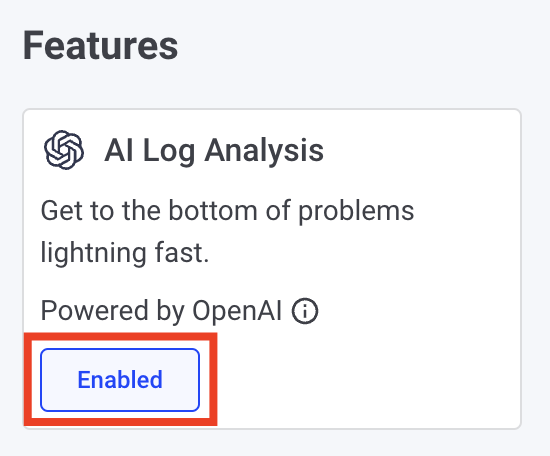
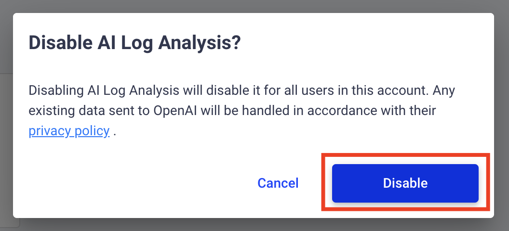

# AI Log Analysis

## Intro

AI log analysis is designed to simplify log analyzing and reading.
Komodor Leverages OpenAI to analyze the log, identify important log lines, provide a potential root cause, and suggest a solution.

  

## Pre-requisites

To use this capability, it has to be enabled on the account level, this can be done by a user who is assigned an `account-admin` role.

1. Navigate to the **settings** page in the user’s dropdown

  

2. On the General tab, "Features" section, Enable the "AI Log Analysis" feature

  

**Please note**:  
- After enabling this feature, **all users** will be able to analyze their logs (for resources they have access to)
- OpenAI’s [privacy policy](https://openai.com/policies/privacy-policy) applies

## How to use this feature

AI Log Analysis is accessible from any log view in the Komodor platform.
Allowing you to send your logs for AI analysis process, trying to find the root cause and suggested solution.

**Please note**:  
Due to OpenAI limitations, the analysis is limited to 50 log lines.

### Log analysis for issues
As part of Komodor's automatic investigation process of an availability issue or failed deploy, logs are automatically collected (when available) and sent to be analyzed, the analysis can be found under the "Container Logs" step or in the "Unhealthy Pods" section.

  

### Log analysis for Live logs view
Enter the Logs tab of a Pod or a Komodor Service, above the logs section you'll notice the AI Log Analysis component.

Click the **“Analyze now”** button to run the analysis.

  

## Disable the feature

1. Navigate to the **settings** page in the user’s dropdown

  

2. On the General tab, "Features" section, click on "Enabled" in the "AI Log Analysis" feature

  

3. Click on "Disable"

  
