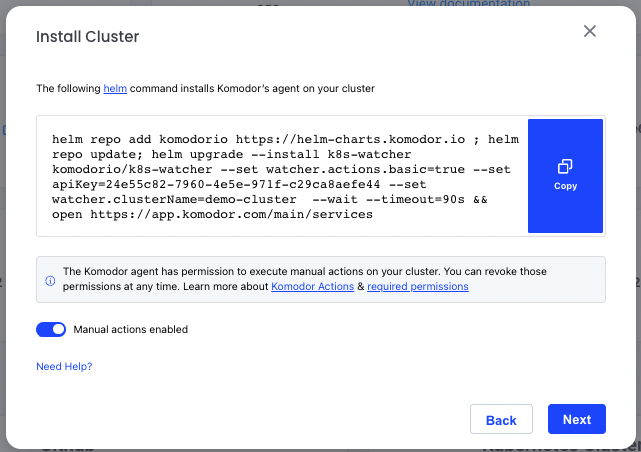

# Actions (initial release) 

To allow our users to close the troubleshooting loop through Komodor, we’re adding the ability to perform Actions through the platform.

Using Komodor you can run multiple actions against your resources, including the ability to terminate Pod/s, scale your Deployments, re-trigger your Jobs, revert a deployment and many more to come.

## Prerequisites 
- Agent version 0.1.104
- Required permissions (as more actions will be supported, more permissions will be required) 
```
  - apiGroups:
    - apps
    resources:
    - deployments/scale
    - statefulsets/scale
    - deployments
    - replicasets
    - statefulsets
    verbs:
    - patch
  - apiGroups:
    - ""
    resources:
    - pods
    verbs:
    - delete
  - apiGroups:
    - batch
    resources:
    - jobs
    verbs:
    - delete
    - create
```
- **Please note:** At this stage, only account **Admins** can see and perform actions against their resources, in the near future we will add the ability to configure granular permissions

## How to opt-in 
### New cluster installation
To install a new cluster with actions enabled just follow the installation process from the Komodor console



### Cluster upgrade
```
helm repo add komodorio https://helm-charts.komodor.io ; helm repo update; helm upgrade --install k8s-watcher komodorio/k8s-watcher --set watcher.actions.basic=true --reuse-values
```

## How to revoke
To disable the usage of Actions using helm, use the following command:
```
helm repo add komodorio https://helm-charts.komodor.io ; helm repo update; helm upgrade --install k8s-watcher komodorio/k8s-watcher --set watcher.actions.basic=false --reuse-values
```

## How does it work?
- User triggers a Manual Action through the Komodor platform 
- A command is registered to the Komodor SaaS 
- The Agent running in the cluster fetches the command from the Komodor SaaS (communication is always done from the Agent outside of the cluster) 
- The command is triggered against the Kuberenetes API 
- Kubernetes will now execute the command
- During the entire process you can track the changes/events through a dedicated Event that will be created on the Komodor timeline.

**Please note:** Due to Kubernetes nature, this feature is built in an asynchronic way, review the timeline after triggering any action for updates

[](https://www.loom.com/share/efa85af0f07c40618f39f4320d9396c2 "Komodor Actions Demo") 

### Audit
For auditing purposes, Manual Actions events are created on the Komodor timeline

### What type of Actions are supported and where can they be triggered from?
We currently the following actions:
- Scale service - Allows modifying the nubmer of replicas for a Service, can be triggered from Deployment/StatefulSet inspection pages (under Workloads) ans also from a Service timeline page
- Delete Pod - Deletes/kills a specific Pod, can be triggered from both the Pod inspection page (under Workloads) and the Pods & Logs screen
- Restart service - Triggers a rolling restart of all the Pods of a Service, can be triggered from Deployment/StatefulSet inspection page (under Workloads) ans also from a Service timeline page
- Re-trigger Job/CronJob - Re-creates the Job to trigger a new run of it, can be triggered from a Job/CronJob timeline, Job/CronJob inspection pages (under Workloads) and from a Job event drawer

## Coming soon / Komodor Actions roadmap
We plan on adding mutliple actions in the near future, here are some of those  
- Create/Update/Delete resource (will be supported for all resources)  
- Modify requests/limits  
- Revert deployment  