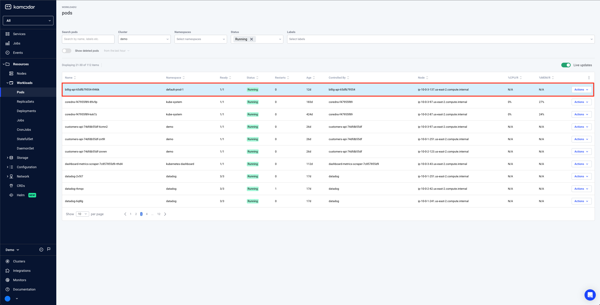
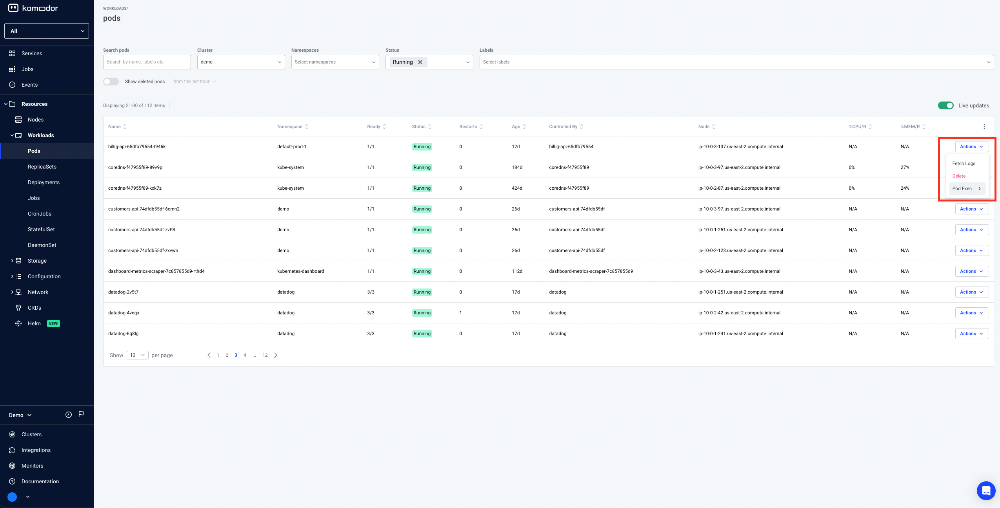
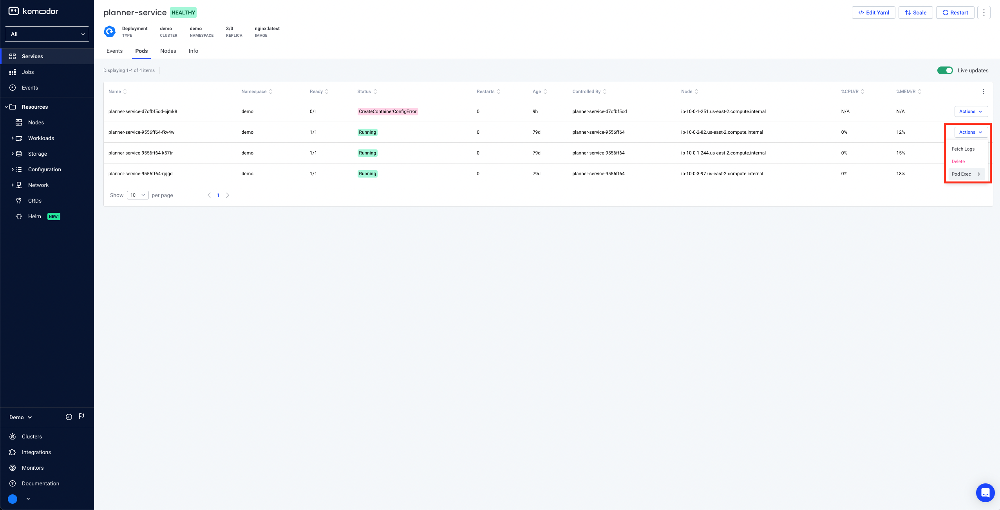

# Pod Shell

Pod shell allows you to initiate a shell session against containers in your clusters so you can run various commands to examine the state of the container from within.

In essense, it is similar to the experience provided by the `kubectl exec -it POD_NAME -- /bin/bash` command

## Prerequisites

- Agent version >= 0.1.173
- Prerequisites for performing actions via the agent (see [here](https://docs.komodor.com/Learn/Actions.html))
- Required Permissions

```
  - apiGroups:
      - ""
    resources:
      - pods/exec
    verbs:
      - create
```

## User permissions
Pod Shell is available for admin users or users with the `pod:exec` Komodor RBAC permission, read more about Komodor RBAC [here](https://docs.komodor.com/Learn/RBAC.html)

## Opting-in

For convienece, the following flag has been added to configure the agent to support pod shell access:

`watcher.actions.podExec=true`

## Agent Upgrade

To upgrade an existing agent to supports pod shell access execute the following command:

```
helm repo add komodorio https://helm-charts.komodor.io ; helm repo update; helm upgrade --install k8s-watcher komodorio/k8s-watcher --set watcher.actions.basic=true --set watcher.actions.advanced=true --set watcher.actions.podExec=true --reuse-values
```

## Revoking Shell Access

If you would like to revoke only pod shell access run the following command:

```
helm repo add komodorio https://helm-charts.komodor.io ; helm repo update; helm upgrade --install k8s-watcher komodorio/k8s-watcher --set watcher.actions.podExec=false --reuse-values
```

If you would also like to revoke actions permission from the agent run the following command:

```
helm repo add komodorio https://helm-charts.komodor.io ; helm repo update; helm upgrade --install k8s-watcher komodorio/k8s-watcher --set watcher.actions.basic=false --set watcher.actions.advanced=false --set watcher.actions.podExec=false --reuse-values
```

## Accessing pod shell

Pod shell is accessible from two main places in Komodor

### Option 1: Via Pods Page

Navigate to pods page on the left navbar


Select a pod in Running state


Either Click on actions -> PodExec


OR Click the pod row -> Click Pod Shell button on the top


The shell is opened


### Option 2: Via Service Page

Select the services page on the left navbar


Select a service with at least one healthy pod


Select the pods tab


Select a pod in Running state


Either click on actions -> Pod Exec


Or click on the pod row -> Click on Pod Shell button on the top


The shell is opened


## How does it work?

- Both client and agent keep a persistent connection to Komodor's backend
- Client initiates a pod shell session
- If there are multiple containers the user will have to choose the container to open the shell session to
- Authentication and authoriztion take place to make sure the client has permissions to run a shell session against the requested pod
- An audit record and an event on the corresponding service timeline are created so you can track pod shell usage
- The agent receives the message and opens a shell session against the requested pod and container using the Kubernetes API
- All subsequent messages are passed from the Client to the Agent, injected into the session and then routed back to the Client for display
- The agent will close the shell session if the client closes the session voluntarily or if the session has been idle for more than 5 minutes.

**Please note:** Agent restarts will cause the session to restart and any in-session state will be lost (environment variables for example)

The remote container has to have either `sh` or `bash` installed on it in order to open a shell session against it

## Multiple Shells & Shell Minimization

You can minimize a shell session. The session will be kept in a tab in the bottom side of the web application. While it is minimized, you can keep exploring your system, move between different pages and interact regularly with the web application. When you'd like to resume to the shell session, click the tab on the bottom of the screen and the terminal will be displayed again.

You can also open and keep multiple shell sessions minimized. In this case you will be able to choose which session you'd like to resume to by using the select menu from the shells tab on the bottom side of the web application.


