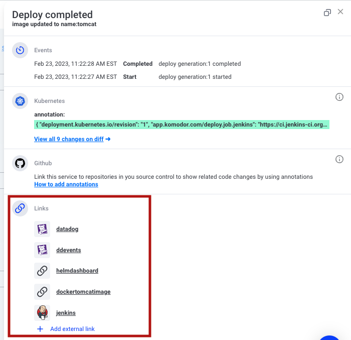

# Komodor Kubernetes Annotations

Komodor annotations enable users to create static and dynamic hyperlinks
to other solutions and resources. For example, you can use Annotations to provide hyperlinks to the following

- Source Control like Git
- DevOps tools 
- Monitoring and observability
- Integrated solutions

**Where does Komodor utilize annotations?**
Komodor uses these annotations enrich service information and creates powerful connections between services.

- Services explorer
- Related services
- Events screen
- Matching alerts to the correct services

There are Annotations you can declare in a **Deployment manifest that will populate specific dashboards
within Komodor**.


<!--div style="height:500px;border:1px solid #000;"></div-->


|Deploy Links    |      Service Links      | 
|:----------:|:-------------:|
|  |   | 


The Yaml Path is ```metadata.annotations```

```
metadata:
  annotations:
    app.komodor.com/deploy.deploy.github: 'https://github.com/cloudecho/hello-world-go'
```

Komodor Annotations provide links from the Troubleshooting components for Deployments and Services 

- The **Info** tab of the Service 
- The **Deployment Details** of a Deployment Event 


Komodor annotations should be placed in the deployment resource annotations (annotations set on the pod template are ignored)


## Annotation Links

Annotation links have  different types:

- Deploy 
- Job
- Service

### Deploy

For each deployment version, you can add a quick link with the relevant filters already in place!

#### Example 

`app.komodor.com/deploy.link.name:url`


| Annotation                         | Values | Description                                 | Example                                                                                                    |
| ---------------------------------- | ------ | ------------------------------------------- | ---------------------------------------------------------------------------------------------------------- |
| app.komodor.com/deploy.link.logs   | url    | Link for the specific version logs          | https://app.logz.io/#/dashboard/kibana/discover?_a=env:123.0.1                                             |
| app.komodor.com/deploy.link.sentry | url    | Link for the specific version Sentry issues | https://sentry.io/organizations/rookoutz/issues/?project=1320440&query=sdk.version%3A1.0.1&statsPeriod=14d |
 

### Job

`app.komodor.com/deploy.job.name:url`
Example:

| Annotation                         | Values | Description                                  | Example                                |
| ---------------------------------- | ------ | -------------------------------------------- | -------------------------------------- |
| app.komodor.com/deploy.job.jenkins | url    | Link to Jenkins job that deploys the service | https://ci.jenkins-ci.org/computer/job |


### Service

| Annotation                         | Values | Description                                 | Example                                                                                                    |
| ---------------------------------- | ------ | ------------------------------------------- | ---------------------------------------------------------------------------------------------------------- |
| app.komodor.com/service.link.logs   | url    | Link for the specific version logs          | https://app.logz.io/#/dashboard/kibana/discover?_a=env:123.0.1                                             |
| app.komodor.com/service.link.sentry | url    | Link for the specific version Sentry issues | https://sentry.io/organizations/rookoutz/issues/?project=1320440&query=sdk.version%3A1.0.1&statsPeriod=14d |


## Customing  Links

You can create custom links to external and internal applications by crafting your own URL to the application using a skeleton URL and placeholders provided by Komodor.
Just copy the URL of the application you want to link to, identify the placeholders in the URL that are used to query the application, and replace them with placeholders for your own use.
Please find the below examples as references for common applications.

### Custom Format 

`app.komodor.com/[deploy|service].link.name:value`

Examples:

| Annotation                            | Values | Description                        | Example                                                                                                                                                                                                                                                                                                                                                                                                                                                                                                                                                                                                                                                                                                                                                                                                                                                                                                                                                                                                                                                                                                                                                                                                                                                      |
| ------------------------------------- | ------ | ---------------------------------- | ------------------------------------------------------------------------------------------------------------------------------------------------------------------------------------------------------------------------------------------------------------------------------------------------------------------------------------------------------------------------------------------------------------------------------------------------------------------------------------------------------------------------------------------------------------------------------------------------------------------------------------------------------------------------------------------------------------------------------------------------------------------------------------------------------------------------------------------------------------------------------------------------------------------------------------------------------------------------------------------------------------------------------------------------------------------------------------------------------------------------------------------------------------------------------------------------------------------------------------------------------------ |
| app.komodor.com/deploy.link.coralogix | url    | Link for the custom URL, coralogix | https://komodortest.coralogix.com/#/query-new/logs?query=(coralogix.metadata.cluster:(%22${cluster}%22))%20AND%20(coralogix.metadata.namespace:(%22${namespace}%22))%20AND%20(coralogix.metadata.service:(%22${service}%22))&time=from:${timestampStart=yyyy-MM-dd'T'HH:mm:ss.SSS},to:${timestampEnd=yyyy-MM-dd'T'HH:mm:ss.SSS}                                                                                                                                                                                                                                                                                                                                                                                                                                                                                                                                                                                                                                                                                                                                                                                                                                                                                                                              |
| app.komodor.com/deploy.link.logzio    | url    | Link for the custom URL, logz.io   | https://app.logz.io/#/dashboard/kibana/discover?_a=(columns:!(message,kubernetes.namespace_name,kubernetes.container_name,params.clusterName),filters:!(('$state':(store:appState),meta:(alias:!n,disabled:!f,index:'logzioCustomerIndex',key:kubernetes.namespace_name,negate:!f,params:(query:default),type:phrase),query:(match_phrase:(kubernetes.namespace_name:${namespace}))),('$state':(store:appState),meta:(alias:!n,disabled:!f,index:'logzioCustomerIndex',key:params.clusterName,negate:!f,params:(query:main),type:phrase),query:(match_phrase:(params.clusterName:${cluster}))),('$state':(store:appState),meta:(alias:!n,disabled:!f,index:'logzioCustomerIndex',key:kubernetes.container_name,negate:!f,params:(query:k8s-events-collector),type:phrase),query:(match_phrase:(kubernetes.container_name:${service})),query:(match_phrase:(kubernetes.container_image:${container[web].image})))),index:'logzioCustomerIndex',interval:auto,query:(language:lucene,query:''),sort:!(!('@timestamp',desc)))&_g=(filters:!(),refreshInterval:(pause:!t,value:0),time:(from:'${timestampStart=yyyy-MM-dd'T'HH:mm:ss.SSS}',to:'${timestampStart=yyyy-MM-dd'T'HH:mm:ss.SSS}'))&discoverTab=logz-logs-tab&switchToAccountId=138828&accountIds=true |
| app.komodor.com/deploy.link.datadog   | url    | Link for the custom URL, DataDog   | https://app.datadoghq.com/apm/traces?query=service%3A${service}%20kube_namespace%3A${namespace}%20env%3A${cluster}&cols=core_service%2Ccore_resource_name%2Clog_duration%2Clog_http.method%2Clog_http.status_code&historicalData=true&messageDisplay=inline&sort=desc&streamTraces=true&start=${epochStart}&end=${epochEnd}&paused=true                                                                                                                                                                                                                                                                                                                                                                                                                                                                                                                                                                                                                                                                                                                                                                                                                                                                                                                      |

The following values can be used to enrich the URL:

| Placeholder                                    | Value                                                           | Example                      |
| ---------------------------------------------- | --------------------------------------------------------------- | ---------------------------- |
| ${epochStart}                                  | Start Time in Epoch Time                                        |
| ${epochEnd}                                    | End Time in Epoch Time                                          |
| ${service}                                     | Service Name                                                    |
| ${namespace}                                   | Namespace Name                                                  |
| ${cluster}                                     | Cluster Name                                                    |
| ${failedPod} \*                                | The pod name of a failed pod that triggered this health event\* |
| ${container[<name\>].image} \*\*               | Image name of a container                                       | ${container[web].image}      |
| ${timestampStart=yyyy-MM-dd'T'HH:mm:ss.SSS}    | Start Time in custom format\*\*\*                               | ${timestampStart=yyyy-MM-dd} |
| ${timestampEnd=yyyy-MM-dd'T'HH:mm:ss.SSS}      | End Time in custom format\*\*\*                                 | ${timestampEnd=yyyy-MM-dd}   |
| ${yaml[<spec_path\>]}                          | Full yaml's path specification                                  | ${yaml[metadata.labels.app]} |

\*Not applicable in Service context.
\*\*Custom links with a failed pod name will be created on health events only.
\*\*\*Dates can be crafted using the display guidelines of date-fns https://date-fns.org/v2.25.0/docs/format

Example on how to use YAML full path:

```YAML
spec:
  replicas: 5
  selector:
    matchLabels:
      app: nginx
  template:
    spec:
      containers:
      - name: test
      image: nginx:1.14.2
        ports:
        - containerPort: 80
      - name: test2
        image: nginx:1.14.2
        ports:
        - containerPort: 80
    metadata:
      lables:
        app.kubernetes.io/name: nginx
        app.kubernetes.io/managed-by: helm 
```

| YAML Path                                                         | Value     | Explanation                             |
| ----------------------------------------------------------------- | --------- | --------------------------------------- |
| ${yaml[spec.replicas]}                                            | 5         | full path usage                         |
| ${yaml[spec.template.spec.containers[0\].name]}                   | test      | full path usage using path index        |
| ${yaml[spec.my_replicas]}                                         | undefined | path doesn't exist                      |
| ${yaml[spec.template.spec.containers]}                            | undefined | path doesn't resolve to an actual value |
| ${yaml[spec.metadata.template.labels['app.kubernetes.io/name']]}  | nginx     | full path usage using dictionary key    |


### Full example

```YAML
apiVersion: apps/v1
kind: Deployment
metadata:
  name: annotation-example
  annotations:
    app.komodor.com/service.link.grafana-overall-system-health: "https://grafana.com/service/annotation-example"
    app.komodor.com/service.link.datadog: "https://datadog.com/dashboard/annotation-example"
    app.komodor.com/service.link.playbook: "https://docs.google.com/playbook"
    app.komodor.com/deploy.job.jenkins: "https://ci.jenkins-ci.org/computer/job"
    app.komodor.com/deploy.link.logs: "https://app.logz.io/#/dashboard/kibana/discover?_a=env:1.0.1"
    app.komodor.com/deploy.link.sentry: "https://sentry.io/organizations/rookoutz/issues/?project=1320440&query=sdk.version%3A1.0.1&statsPeriod=14d"
    app.komodor.com/service.link.datadog: "https://app.datadoghq.com/apm/traces?query=service%3A${service}%20kube_namespace%3A${namespace}%20env%3A${cluster}&cols=core_service%2Ccore_resource_name%2Clog_duration%2Clog_http.method%2Clog_http.status_code&historicalData=true&messageDisplay=inline&sort=desc&streamTraces=true&start=${epochStart}&end=${epochEnd}&paused=true"
spec:
  selector:
    matchLabels:
      run: example
  replicas: 1
  template:
    metadata:
      labels:
        run: example
    spec:
      containers:
        - name: hello-world
          image: gcr.io/google-samples/node-hello:1.0.1
          ports:
            - containerPort: 8080
              protocol: TCP
```

# Annotations Best Practices

At Komodor we believe that k8s annotations are the best method for describing services metadata.
This includes all the “extra” fields used to tag and label your services, both for other team members and for external tools.
BTW, We collect data from both annotations and labels.

### [Official Kubernetes recommendations](https://kubernetes.io/docs/concepts/overview/working-with-objects/common-labels/)

```yaml
app.kubernetes.io/component: database
app.kubernetes.io/part-of: wordpress
app.kubernetes.io/managed-by: helm
```

### Komodor recommendations

```yaml
app.komodor.com/label.team: backend
app.komodor.com/label.group: infrastructure
app.komodor.com/label.owners: "infa-team"
app.komodor.com/label.alert-team: "devs"
app.komodor.com/label.Impacted-by: redis
```

### Usage example

- Tagging Team annotations on relevant services and adding relevant metadata on the alert metadata in datadog.
- Using the Team name in the alert tools (for example PagerDuty) as part of the Komodor labels.
