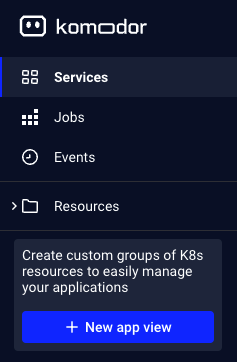

# Application Views
Application views allow users to generate a scoped Komodor environment focused on the relevant Kubernetes workloads (Deployments, DaemonSets, StatefulSets, Rollouts, Jobs, CronJobs) selected by the users and their related resources.

When creating an Application view, the user will be provided with the Overview section which persist on the following component:
- Availability issues histogram - visualizes all the Availability issues associated with your application 
- Resources inventory - provides a list of the resources related to the application  
- List of open availability issues  
- List of recent deployments    

On top of that, you can easily navigate between the Services, Jobs, Events & Resources sections, those will be scoped to the relevant selected workloads.

## Creating an Application View
To create an application view click the New app view button
- First Application creation  
   
- Add additonal Application - Open the list box on the top of the navigation toolbar  

- Specify your Application configurations, name, description and selected services  

- Save your application view by selecting Create app view

## Update an Application View
To update an application view, enter the overview page and click on the settings button on the top right, make the wanted changes and save them.
