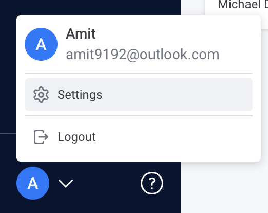
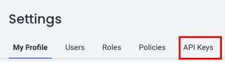
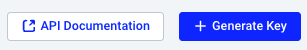
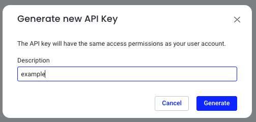

# Create Personal Access Token
Review the API documentation [here](https://api.komodor.com/mgmt/api#/).  

To create a personal access token follow the following process:  

1. Access the settings page  
   

2. Go to the API Keys tab  
   

3. Click Generate Key  
   

4. Add a description and click Generate  
   

5. You can now use the generated API key from the table  
   

