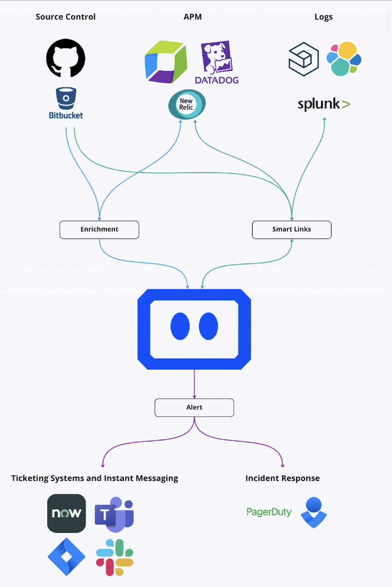
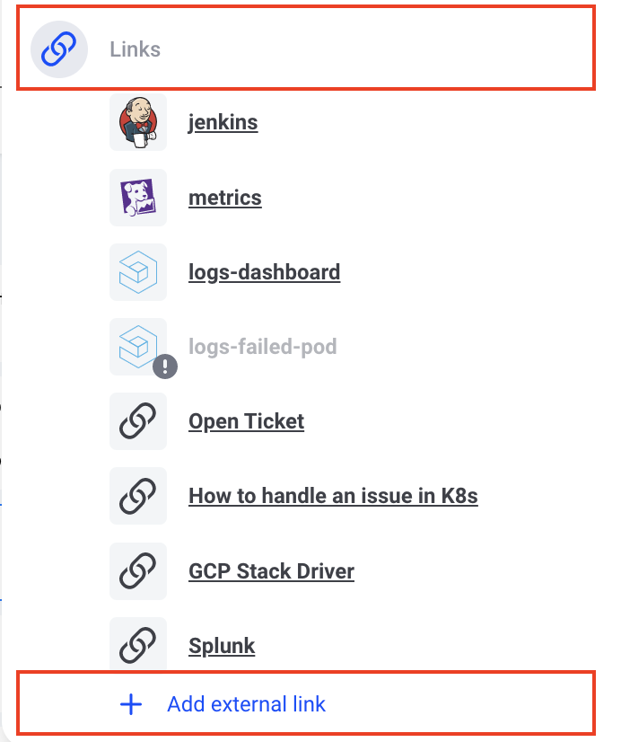
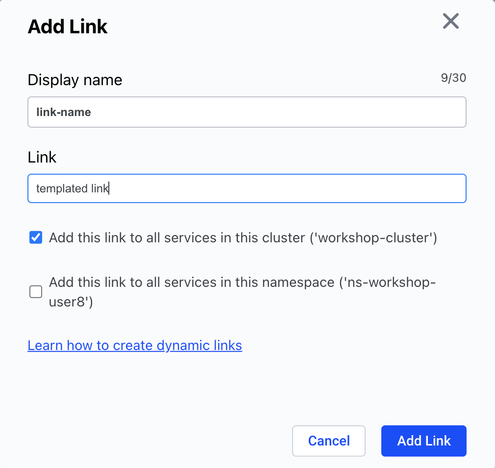

# Komodor External Links

Custom links allow to connect your systems and create an easy navigation from Komodor to your logging, metrics, ticketing & documentation systems with the relevant context.

## How It Works?

Komodor generate the link based on a link template. After adding the template, Komodor generates the links in each one of the screens.

Use the Komodor Smart Links to connect between Komodor to any system that you have!
<br>


## Common Use-Cases

Here are a few examples for common use cases:

- Add a link on Komodor's availability issues to the logging system dashboard (like Kibana) that is pre-filtered with values like the cluster name, the namespace, the name of the pod, and the relevant timeframe. 
- Add a link on Komodor's availability issues relevant metrics dashboards (Grafana / DataDog / NewRelic) with pre-filtered values like the cluster name, the namespace, the name of the pod, and the relevant timeframe.
- Add a link from Komodor to the relevant internal documentation.
- Add a link from Komodor to the relevant support ticket system.

## How To Add?
1. Go into the one of the services, click on one of the events, go to the links section (in avilability issues, it will be in the deploy section) and click on "add external link".
<br>

<br>
2. Fill the information in the modal:
<br>


You can define the link to be on a cluster wide scope.

## How To Template Your Links?
- Go to the relevant system which you want to add link to it in Komodor.
- Filter the dashboard with the values that you want to create a deep link which can be templated.
- Template the link using [this documentation](/Learn/Annotations.html#how_2).

## Common Examples

### DataDog Service Logs
``` bash
https://app.datadoghq.com/logs?query=service%3Ae${service}&cols=host%2Cservice&index=%2A&messageDisplay=inline&stream_sort=desc&viz=timeseries&from_ts=${epochStart}&to_ts=${epochEnd}&live=true
```

### DataDog Failed Pod's Logs
``` bash
https://app.datadoghq.com/logs?query=service%3A${service}%20pod_name%3A${failedPod}&cols=service&index=%2A&messageDisplay=inline&stream_sort=time%2Cdesc&viz=stream&from_ts=${epochStart}&to_ts=${epochEnd}&live=false
```

### DataDog Pods Dashboard
``` bash
https://app.datadoghq.com/dash/integration/30322/kubernetes-pods-overview?tpl_var_cluster=${cluster}&tpl_var_deployment=${service}&tpl_var_namespace=${namespace}&from_ts=${epochStart}&to_ts=${epochEnd}&live=true
```

### Logz.io / Kibana Failed Pods's Logs
``` bash
https://app.logz.io/#/dashboard/kibana/discover?_a=(columns:!(message),filters:!(),index:'logzioCustomerIndex*',interval:auto,query:(language:lucene,query:'params.kubernetes.pod_name%20%3D%20${failedPod}'),sort:!(!('@timestamp',desc)))&_g=(filters:!(),refreshInterval:(pause:!t,value:0),time:(from:'${timestempStart=yyyy-MM-dd'T'HH:mm:ss.SSS}Z',to:'${timestempEnd=yyyy-MM-dd'T'HH:mm:ss.SSS}Z'))&accountIds=138818&switchToAccountId=138818
```

### Grafana Pod Metrics
``` bash
http://local.grafana.com/d/6581e46e4e5c7ba40a07646395ef7b23/kubernetes-compute-resources-pod?orgId=1&var-datasource=default&var-cluster=&var-namespace=$(namespace}&var-pod=${failedPod}&from={epochStart}&to=${epochEnd}
```

### Grafana Service Metrics
``` bash
http://104.154.113.136:60001/d/a164a7f0339f99e89cea5cb47e9be617/kubernetes-compute-resources-workload?orgId=1&var-datasource=default&var-cluster=&var-namespace=${namespace}&var-type=deployment&var-workload=${service}&from=${epochStart}&to=${epochEnd}
```

### Loki Failed Pod's Logs
``` bash
http://local.grafana.com/d/fRIvzUZMz111/logging-dashboard-via-loki?orgId=1&var-container=${yaml[spec.template.spec.containers[0].name]}&var-pod=${failedPod}&var-stream=All&var-searchable_pattern=&from=${epochStart}&to=${epochEnd}
```

### Loki Deployment Logs
``` bash
http://104.154.113.136:60001/d/fRIvzUZMz111/logging-dashboard-via-loki?orgId=1&refresh=5s&var-container=${yaml[spec.template.spec.containers[0].name]}&var-pod=All&var-stream=All&var-searchable_pattern=&from=${epochStart}&to=${epochEnd}
```

### ArgoCD Application
``` bash
https://local.argocd.app/applications/argocd/${yaml[metadata.labels['argocd.argoproj.io/instance']]}?view=tree
```

