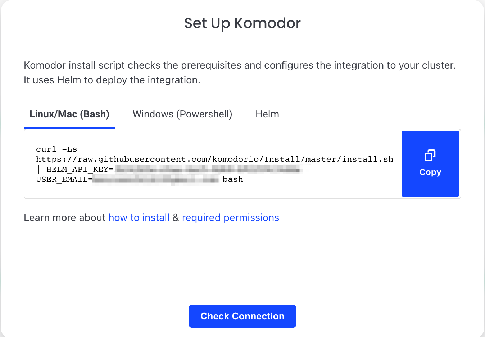
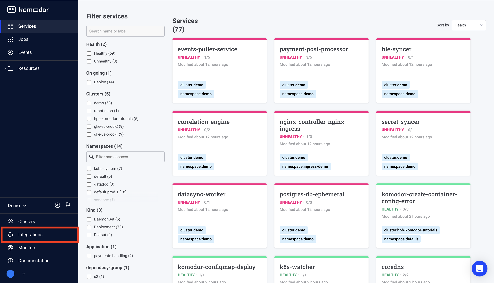
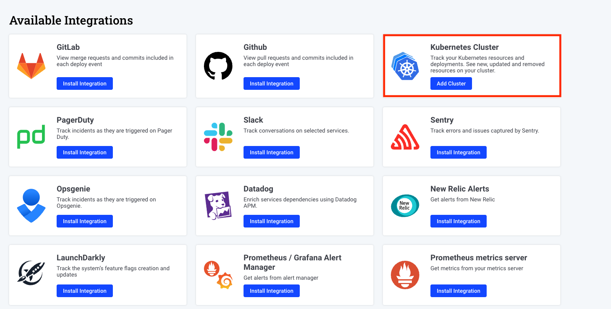

# Getting started

Welcome to Komodor, the dev-first Kubernetes operations platform 👋

Follow these instructions to quickly install our Agent on the clusters you want to manage, monitor, and track changes on. 
  To unlock Komodor’s full potential take a deep dive into the feature docs, and [join our Slack Kommunity](https://join.slack.com/t/komodorkommunity/shared_invite/zt-1lz4cme86-2zIKTRtTFnzL_UNxaUS9yw), where you can meet fellow Komodor users, exchange knowledge, and get support from our team.

<iframe width="560" height="315"
src="https://www.youtube.com/embed/StFiQtH8L8Q" 
frameborder="0" 
allow="accelerometer; autoplay; encrypted-media; gyroscope; picture-in-picture" 
allowfullscreen></iframe>

## What is Komodor

Komodor is a Kubernetes operations platform for developers, complete with automated playbooks for every K8s resource, and static-prevention monitors that enrich live & historical data with contextual insights to help enforce best practices and stop incidents in their tracks. 
  By baking K8s expertise directly into the product, Komodor is accelerating development cycles, reducing MTTR, and empowering dev teams to manage their K8s apps efficiently and independently.

The komodor agent consists of two main components:
* `Komodor-agent` deployment - responsible for collecting data from the kubernetes API and sending it to the komodor platform.
* `Komodor-agent-daemon` daemonset - responsible for collecting metric data from nodes and pods and sending it to the komodor platform.

----
## Quick start TL;DR
in order to easily deploy your first agent - follow the following steps  

### Step 1 - Sign up to Komodor
To create your account, [sign up](https://app.komodor.com/#mode=signUp) for Komodor with your email address or by using SSO using your Google, GitHub or Microsoft account.

### Step 2 - Deploy the komodor agent on your cluster

1. Select the relevant script: Powershell (Windows) or Bash (Linux/Mac) and copy the installation command.
2. Make sure to switch to the relevant cluster context before running the command.
3. Execute the installation command from your terminal.

### Step 3 - Start exploring the platform
After installing the Komodor Agent you will be able to view all the K8s resources in your clusters on the Komodor platform web UI.   

To unlock Komodor’s full potential take a deep dive into the feature docs. Take a glance below at some of the key capabilities Komodor has to offer. 

👁️ Observe: Cross-cluster Visibility
Uncover your resources with a robust K8s dashboard
Easily explore and navigate through your Kubernetes resources across clusters from a single pane of glass
View metrics, logs, K8s events and inspect resources in real-time

Learn how to [set up your first monitors](./Monitors.md) for each K8s resource

⚙️ Manage: Simplified Cluster Management
Easily run day-to-day operations like restarting a service, rollbacks, comparing resources, setting requests/limits, etc.
Control more complex configurations by editing resources, manifests and config files
Validate your K8s configurations with real-time feedback for best practices

Learn how to [interact](./Actions/Overview.md) with your K8s cluster using Komodor

🛠️ Troubleshoot: Automated and Guided
View the entire history of changes and events to quickly correlate issues
Instantly know if an issue is infra or app-related
Run automatic playbooks for common K8s incidents
Get simple remediation instructions and take action with just one click

Learn how to use Komodor to [troubleshoot](https://youtu.be/nmgVHuv5T6A) issues in your K8s application

---
## Adding additional clusters
 Komodor allows you to manage multiple clusters from a single pane of glass!  
 In order to add additional clusters to your account, you will need to repeat the installation process for each cluster.

1. Go to the Integration page by clicking the Integrations tab on the lefthand navigation menu.
   

2. Click on ‘Add Cluster’ in the Kubernetes cluster integration prompt.
   
3. Copy the installation command including the cluster name and the api key for the relevant cluster and execute it from a terminal with a kubectl context configured to the relevant cluster.

## Advanced configurations
To tailor the agent's functionality, go ahead and explore the [Advanced Agent Configuration Guide](./Advanced-Configurations.md).