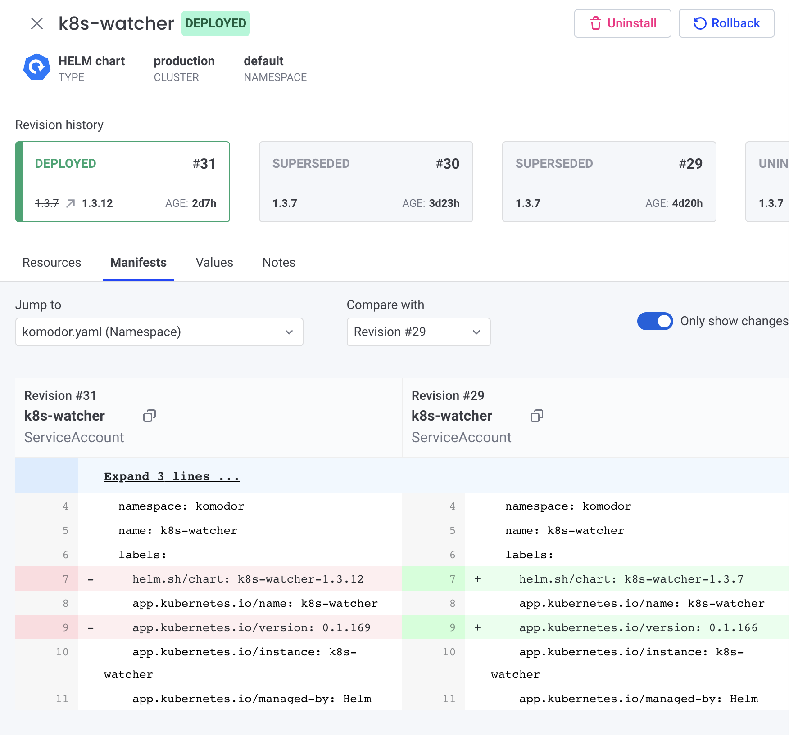
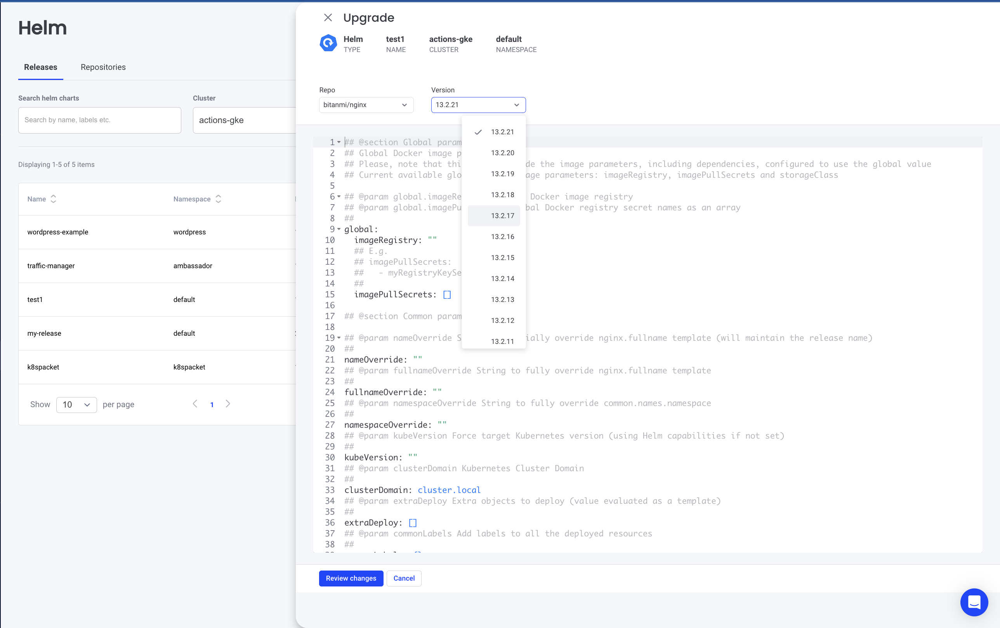

# HELM

## Overview
As part of Komodor vision of helping Kubernetes users to navigate and troubleshoot their clusters, Komodor provides an extensive UI to view and manage installed Helm charts, and see their revision history and corresponding k8s resources. It also allows performing simple actions like rollback to a previous revision or upgrading to a newer version.

Some of the key capabilities are:  

- Multiple clusters support  
- See all installed charts and their revision history   
- See manifest diff of the past revisions   
- Browse k8s resources managed by the chart   
- Easy rollback or upgrade version with a clear and easy manifest diff   

## Pre-requisites 
### Agent permissions/values
In order to add those capabilities, the Komodor agent has to have permission to read and manipulate secrets.

To add those permissions, enable the following values on the helm chart:  

- **watcher.resources.secret=true** - allows Komodor agent to send secrets to the Komodor SaaS (all secrets are redacted by default)  
- **watcher.enableHelm=true** - allows Komodor agent to send Helm-related secrets without redaction  
- **helm.enableActions=true**  - adds relevant permissions to the Komodor agent to allow performing various helm-related actions (manipulation of secrets)  

### Upgrade command
`helm repo update; helm upgrade --install k8s-watcher komodorio/k8s-watcher --set watcher.resources.secret=true --set watcher.enableHelm=true --set helm.enableActions=true --reuse-values`

### Permissions 
You can control who has access to view or modify helm charts within your clusters using Komodor RBAC.
The following actions can be specified on the RBAC policy level:

`read:helm-repo`  
`update:helm-repo`  
`add:helm-repo`  
`remove:helm-repo`  
`install:helm-chart`  
`uninstall:helm-chart`  
`revert:helm-chart`  

**Please note:** account-admin would be able to perform all of those

## Releases (charts)
When entering the HELM section in the Komodor UI, on the releases tab, you can see all your helm charts, you can filter them, and perform various actions on them. 

When viewing a specific release, you can easily get the revision history

You can also compare its manifest/values with other revisions.

## Helm Actions

Supported actions for charts:
- Upgrade - will only appear when a repository containing the chart is configured for the relevant cluster.   
You’ll be able to select either a newer or older version of that chart.  

    This action performs the following helm command  
    `helm upgrade --install ${name} ${chartName} --create-namespace --namespace ${namespace} --version ${version} --values ${values}`
- Uninstall - Uninstall a chart.  
Will perform the following command:  
`helm uninstall RELEASE_NAME [...] [flags]`  
- Rollback - Rollback to the chosen version.  
Will perform the following command:   
`helm rollback <RELEASE> [REVISION] [flags]`

## Repositories
To enable upgrading HELM charts directly from Komodor you have to add the HELM repositories where your charts reside.

Adding a repository: 

- Navigate to the HELM under the Resources section in Komodor   
- Switch to the Repositories tab  
- Click “Add Repository”  
- Specify the repository details - Name, URL, and Clusters to associate this repository with  
- Save the repository  

Behind the scenes, the Komodor Agent will install those repositories and will use them to initiate the relevant commands. 

**Please note:** Currently, the only repo authentication method supported is user:password

