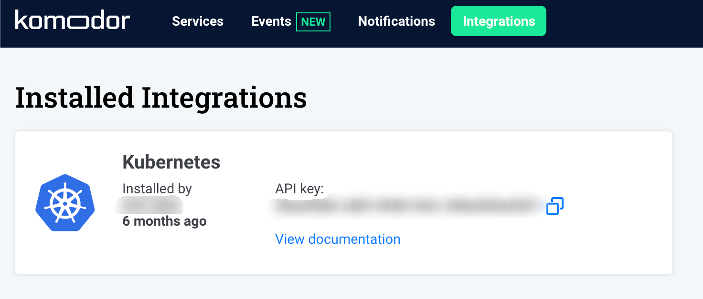

# Komodor's Agent

## Installation

!!! Note ""
    Before installing the agent, get your API key from the Integration page



### Kustomize

```bash
export KOMOKW_API_KEY= # API KEY Required
export KOMOKW_CLUSTER_NAME= # Optional
kubectl create ns komodor
kubectl apply -n komodor -k https://github.com/komodorio/helm-charts/manifests/overlays/full/?ref=master
```
### Helm

```bash
helm repo add komodorio https://helm-charts.komodor.io
helm repo update
helm upgrade --install k8s-watcher komodorio/k8s-watcher \
 --set apiKey=YOUR_API_KEY_HERE \
 --set watcher.clusterName=CLUSTER_NAME \
 --set watcher.enableAgentTaskExecution=true \
 --set watcher.allowReadingPodLogs=true

```

## Permissions
Komodor's Agents uses the native RBAC model of Kubernetes. All the permissions are listed here:

1. [helm](https://github.com/komodorio/helm-charts/blob/master/charts/k8s-watcher/templates/clusterrole.yaml)
2. [kustomize base](https://github.com/komodorio/helm-charts/blob/master/manifests/base/clusterrole.yaml), [kustomize final](https://github.com/komodorio/helm-charts/blob/master/manifests/overlays/full/logs-reader.cr.yaml)


## ARM Support

* linux/amd64
* linux/arm64 (v8) - starting from agent version 0.1.29

The default is linux/amd64. If you wish to install the chart for linux/arm64 all you need to do is `--set image.arm=true` flag.

## Advanced Configuration

The agent uses configuration file `komodor-k8s-watcher.yaml`, all the agent's features and capabilities can be configured here (assuming the RBAC permissions are satisfied).
More detailed list can be found [here](https://github.com/komodorio/helm-charts/tree/master/charts/k8s-watcher#configuration)

### Data Reduction
[Read more](./Sensitive-Information-Redaction.md)

### Resources
By default the agent watching on almost all the resources (**secrets and events are opt out**)
To turn on/off resource:

1. Helm: `--set watcher.resources.RESOURCE=true/off`
2. Kustomize: update the configuration file and the RBAC rule to have `get`, `list` and `watch` permissions

### Namespaces
The agent watching all the namespaces, by default `watchNamespace=all` watching all namespaces.

To watch single namespace:

1. Helm: `--set watcher.watchNamespace=NAMESPACE`
2. Kustomize: patch the configuration file `watchNamespace=NAMESPACE`

#### Blacklisting
Using `namespacesBlacklist` you can opt list of namespaces


### Agent Tasks
Agent tasks are used to interact with the cluster on demand, read more about interaction with the cluster [here](./Interaction-With-The-Cluster.md)

To enable agent tasks (default is `off`):

1. Helm: `--set watcher.enableAgentTaskExecution=true && --set watcher.allowReadingPodLogs=true`
2. Kustomize: The `full` overlay already has this turned on. If you are building it manually from `base`, patch the configuration file `enableAgentTaskExecution=true` and make sure to have RBAC permissions to `get` and `list` for `pods` and `pods/log`


### Environment Variables
Alternativly, you can pass the configuration as environment variables using the `KOMOKW_` prefix and by replacing all the . to _, for the root items the camelcase transforms into underscores as well.

For example:
```bash
# apiKey
KOMOKW_API_KEY=1a2b3c4d5e6f7g7h
# watcher.resources.replicaSet
KOMOKW_RESOURCES_REPLICASET=false

# watcher.watchNamespace
KOMOKW_WATCH_NAMESPACE=my-namespace
# watcher.collectHistory
KOMOKW_COLLECT_HISTORY=true
```


## Uninstalling

### Kustomize
```bash
kubectl delete ns komodor
```

### Helm
```bash
helm uninstall k8s-watcher
```
