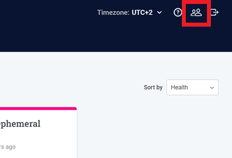
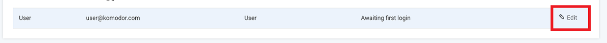
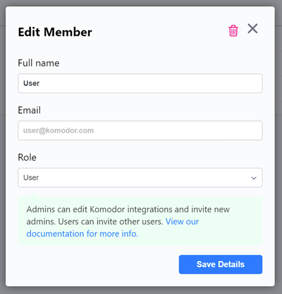
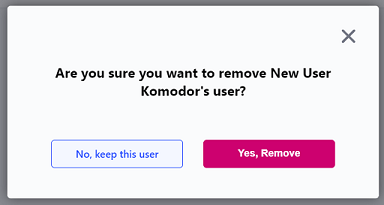

# How to Manage Users

This article will detail how to Invite, Modify and Delete users in the Komodor platform.

## How to Invite/Add a new user

1. To invite another user click on the manage team icon in the top right corner, this will take you to the "Manage Team" page.
   
   

> **_Note:_** You must have the Admin role in order to invite another Admin to the platform.

2. Click on "Add Member".
   
   

3. Provide the users Full Name, Email Address and select a role for the user and then click "Send Invite" to invite the user to the platform.

   

> **_Note:_** More on user roles can be found [here](https://docs.komodor.com/Learn/RBAC.html "Komodor RBAC").

5. The user will receive an invitation to the platform, click "Close" to finish.

   

## How to modify an existing user

1. Click on the manage user icon in the top right corner, this will take you to the "Manage Team" page.

   

2. You will see a list of users for the account, select "Edit" to the far right of the user you wish to modify.

   

3. In the "Edit Member" dialogue, modify the users Full Name or Role and click on "Save Details" to save the changes.

   

> **_Note:_** In order to change a users email address you will need to create a new user by inviting them to the platform using their new email address. 

## How to delete a user

1. Click on the manage user icon in the top right corner, this will take you to the "Manage Team" page.

   

2. You will see a list of users for the account, select "Edit" beside the user you wish to delete.

   

3. On the "Edit Member" dialogue, click on the red garbage bin in the top right corner to delete the user.

   

4. Click on "Yes, Remove" to delete the user.

   
