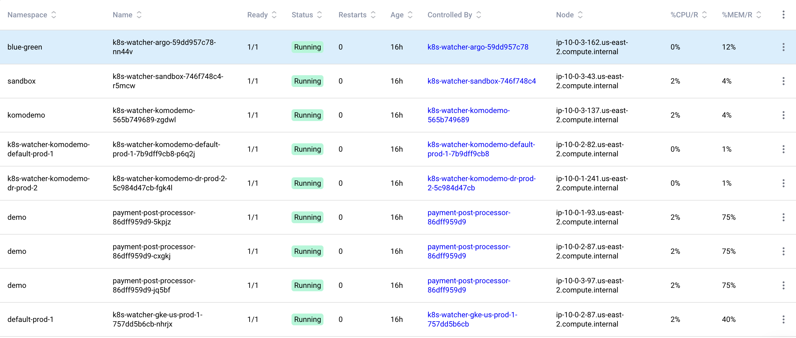
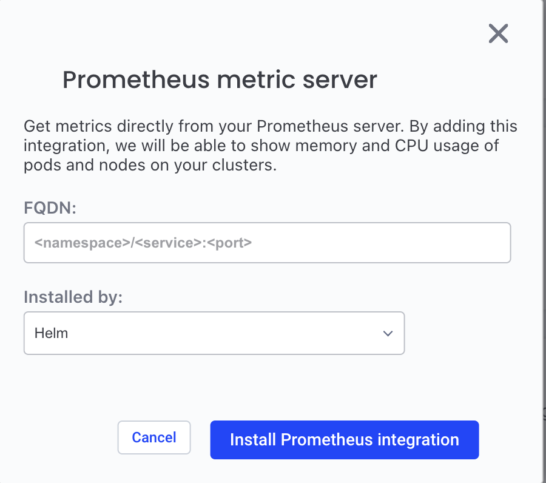

# Metrics

Komodor enables you to overview metrics like cpu and memory on your cluster using the prometheus metrics server.

## Prerequisites

- Agent version from 0.1.108
- Installed prometheus on your cluster

Coming soon: prometheus installation integration!

## How does it work?

Komodor agent identifies prometheus in the cluster and saves the configuration details.
The agent sends an HTTP request to the prometheus metrics server and gets matric results like cpu and memory. The received data is processed and displayed in the “Pods” screen.

Data is displayed in 2 columns:

- %CPU/R - percentage of cpu usage per request
- %MEM/R - percentage of memory usage per request

## Add metrics integration

In case you have prometheus in your cluster and the agent doesn’t identify it you can add metrics integration.

### Steps:

1. Go to integration screen and click on Prometheus metrics server

<figure>
    
</figure>

2. Enter the fqdn as follows: `<namespace>/<service>:<port>`

- Namespace - prometheus service namespace
- Service - prometheus service name
- Port - The port that prometheus service is listening to
<figure>
    
</figure>

3. Choose how you installed prometheus: helm or other operator
4. Click install
