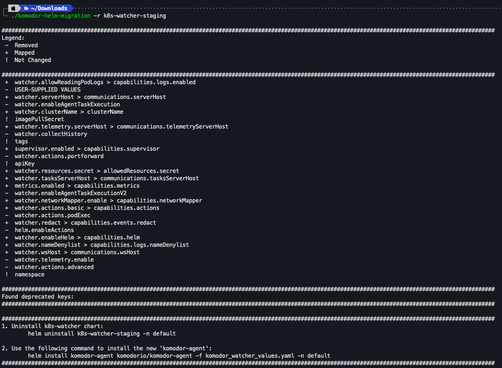

# Migrating from the Komodor K8s Agent Chart

## Introduction

As k8s-watcher is being deprecated, we have created a migration tool to help you migrate to the new komodor-agent chart.

## Prerequisites
* `Helm` 3.0 or later
* `Kubectl` and a kubeconfig file configured to connect to your cluster

## Migrating from the Komodor K8s Agent Chart

1. Download the `komodor-helm-migration` tool from the [releases page](https://github.com/komodorio/helm-charts/releases/tag/v0.3.0):
2. Make the tool executable:

    ```bash
    chmod +x komodor-helm-migration<OS>_<ARCH>
    ```

    For example, to make the tool executable on a Mac with an M1 chip:

    ```bash
    chmod +x komodor-helm-migration-darwin_arm64
    ```
   
3. Execute the following command to output an updated values file

    ```bash
    ./komodor-helm-migration<OS>_<ARCH> -r <INSTALLED_RELEASE_NAME>
    ```

    For example, to output an updated values file for a release named `k8s-watcher-staging`:

    ```bash
    ./komodor-helm-migration-darwin_arm64 -r k8s-watcher-staging
    ```
   
    

3. Command will show an output for all removed, unchanged and automatically mapped values


4. Follow the instructions to uninstall the old k8s-watcher chart and install the new komodor-agent chart.

