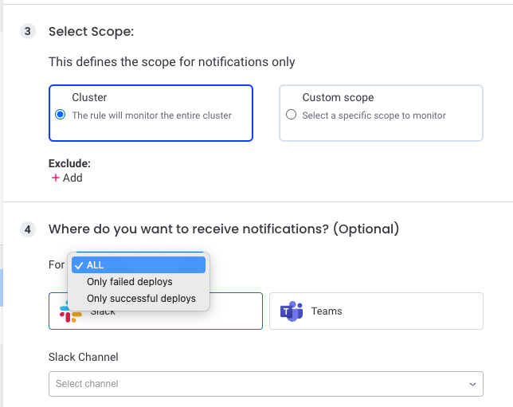

# Monitors

Komodor Monitors are built to detect different scenarios, investigate certain aspects around them and provide additional context to simplify the troubleshooting process and reduce the MTTR.

## Supported configurations per Monitor :

Komodor monitors are being configured on a cluster level, each monitor supports the following configurations:

- Trigger conditions - specify when this monitor should be triggered, conditions vary per monitor.
- Scope - which resources should be monitored, the scope can be configured for the entire cluster, specific namespaces, annotations or labels, the relationship between the selected resources is currently OR relationship.
- Sink/Notification - where do you want to receive notifications (Slack/Teams/OpsGenie/PagerDuty).

## Prerequisites:

**Required agent version** - 1.0.78 (recommended - latest version)

## Availability Monitor

Monitor your workload’s health (available replicas < desired replicas), creates an Availability issue on the Events and Service timelines that provides relevant information to resolve the issue.
The Availability monitor will not be triggered during an active rollout.

**Please note** Modifying the scope of an Availability monitor might affect (remove) events from the timeline.

- Monitor is triggered by -
  Service (Deployment/DaemonSet/Rollout/StatefulSet) number of available replicas < desired replicas by the specified conditions for the defined duration

- The following checks are performed -
  - Pods health
    Foreach Pod we'll provide the following: - Phase, Reason, Pod events - Containers list with their state, reason & logs
  - Service latest deployments
  - Service describe

**Please note** Data provided in the Availability issue checks is a snapshot in time for when the issue occurred.

**Please note** It is possible to costume your notifications to alert for specific error categories.

Each **category** is including the following **reasons** :

<table>
  <tr>
    <th>Category</th>
    <th>Reasons</th>
  </tr>
  <tr>
    <td>NonZeroExitCode</td>
    <td>NonZeroExitCode</td>
  </tr>
  <tr>
    <td>Unhealthy</td>
    <td>Unhealthy</td>
  </tr>
  <tr>
    <td>OOMKilled</td>
    <td>OOMKilled, NonZeroExitCode - Exit code: 137</td>
  </tr>
  <tr>
    <td>Creating/Initializing</td>
    <td>ContainerCreating, PodInitializing, PodNotReady, ContainersNotReady, ReadinessGatesNotReady</td>
  </tr>
  <tr>
    <td>BackOff</td>
    <td>BackOff, CrashLoopBackOff, ImagePullBackOff</td>
  </tr>
  <tr>
    <td>Infrastructure</td>
    <td>NodeNotReady, NetworkNotReady, Evicted,NodeShutdown, Terminated, Preempted</td>
  </tr>
  <tr>
    <td>Pending</td>
    <td>FailedScheduling, NotTriggerScaleUp, PodPending, NodeAffinity</td>
  </tr>
  <tr>
    <td>Image</td>
    <td>ErrImagePull, InvalidImageName</td>
  </tr>
  <tr>
    <td>Volume/Secret/ConfigMap</td>
    <td>FailedMount, FailedAttachVolume, CreateContainerConfigError</td>
  </tr>
  <tr>
    <td>Container Creation</td>
    <td>CreateContainerError, RunContainerError, ContainerCannotRun, ContainerStatusUnknown</td>
  </tr>
  <tr>
    <td>Pod Termination</td>
    <td>FailedPreStopHook, FailedKillPod</td>
  </tr>
  <tr>
    <td>Completed</td>
    <td>Completed</td>
  </tr>
  <tr>
    <td>Other</td>
    <td>Any reason that was not mapped in other categories</td>
  </tr>
</table>

## Deploy Monitor

A Deploy monitor will be trigerred whenever a resource is being deployed/rolled-out.  
Using the Deploy Monitor configuration you can define on what resources (scope) and in what occasion (failed deploy/successful deploy/both) when you would like to get a notification in one of your notification channel (Slack/Teams)  

## Node Monitor

Monitors Nodes with faulty [Conditions](https://kubernetes.io/docs/concepts/architecture/nodes/#condition).

- Monitor is triggered by -
  Node Conditions change to a faulty Condition, the faulty condition/s last through the configured Duration
- We perform the following checks as part of our investigation
  - Is the node ready?
  - Is the node overcommitted?
  - Is the node under pressure?
  - Are system Pods healthy?
  - Is the network available?
  - Are Pods being evicted?
    -Are user pods healthy?
  - Is the node scheduable?
  - Node overall resource consumption including top 5 pod consumers (requires metric-server installed)
- Notes
  - The Node detector currently does not deal with nodes in an Unknown state (this means Spot interruptions or scale-down events will not be handled by the WF, could affect other scenarios as well)
  - Will only run on Nodes that are created for more than 3 minutes (there is a 3-minute delay from Node create time prior to running the WF)

## PVC Monitor

Monitors PVCs in a pending state.

- Triggered by -
  PVC in a pending state for the defined duration
- We perform the following checks as part of our investigation
  - PVC creation, utilization, and readiness issues
  - Volume provisioner related issues
  - PVC spec change
  - Identify the impact on your services

## Job Monitor

The Job Monitor will be triggered when a job fails execution.  
It allows you to get notified for Job failures on the defined scope.

## CronJob Monitor

The CronJob Monitor will be triggered when a job (managed by CronJob) fails execution.  
It allows you to get notified for the first (first failure ater a success) or any CronJob failures on the defined scope.
