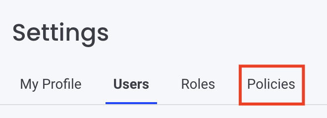
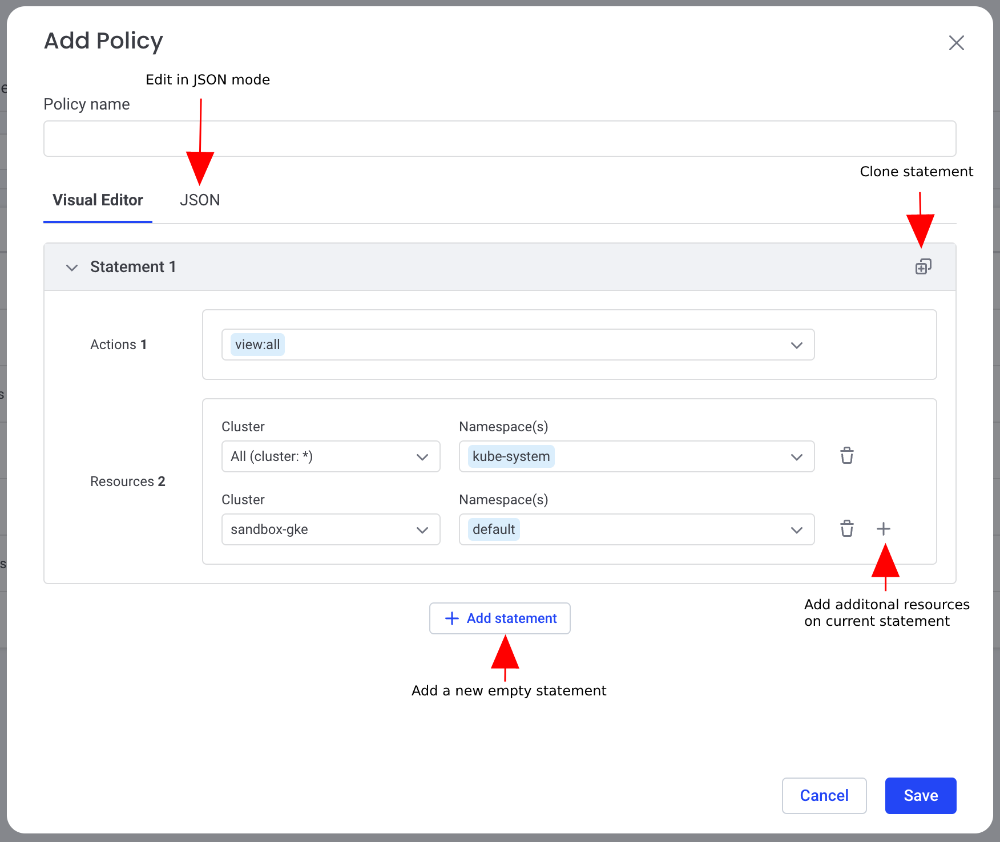
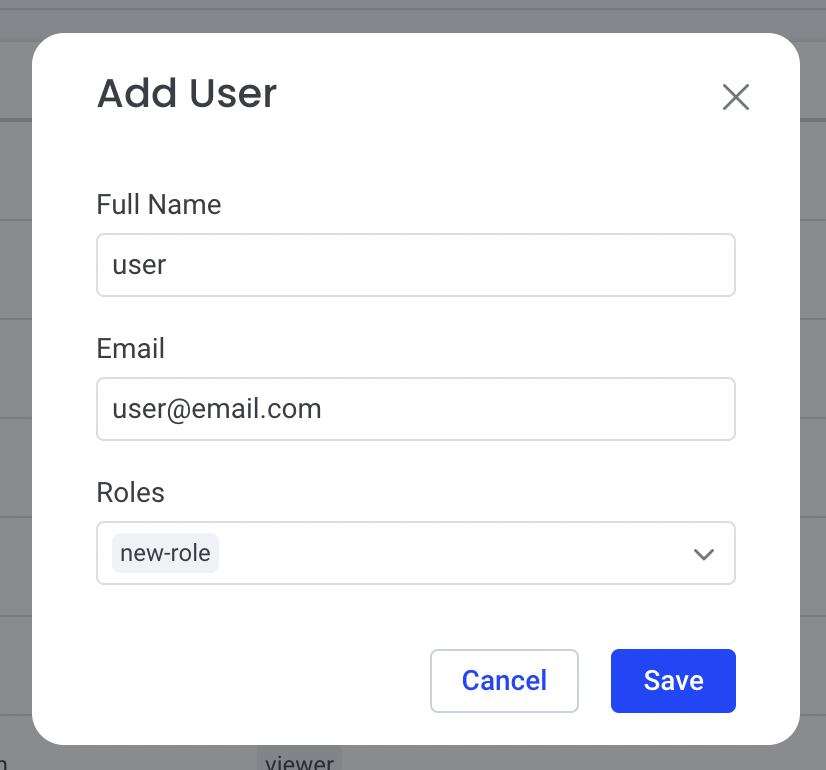

# Role-Based Access Control

## Intro
Komodor allows assigning users with Roles to control their access and permissions (such as what data they can read or which resources they can modify).

## Komodor Roles
Roles are built from one or more policies.

### Built-in Roles
- account-admin - has full permissions on the account
- viewer - has access to view all resources on the account
- developer - has access to view all resources and perform the following basic actions:
``` 
    "delete:pod",
    "scale:deployment",
    "scale:statefulset",
    "restart:deployment",
    "restart:statefulset",
    "rerun:job"
```
Learn more about [actions](https://docs.komodor.com/Learn/Actions.html)  

**Please note** - The built-in account-admin role and policy cannot be modified, there has to be at-least one account-admin on the account, the last account-admin cannot be removed or provided with a different role.

## Komodor Policies
Policies define a set of actions & resources they can performed at.

A policy is built from a list of Statements, formatted as follows:
```
[   
    {
        "actions": [],
        "resources": []
    },
    {
        "actions": [],
        "resources": []        
    }
]
```

### Actions
A list of allowed actions, formatted as follows:  
`action:supported-resource-type`  

List of the supported combinations:

|  Action 	|                                                 Supported Resource Types                                                 	|
|:-------:	|:------------------------------------------------------------------------------------------------------------------------:	|
| view    	| * (all)                                                                                                                  	|
| edit    	| * (all), deployment, statefulset, daemonset, replicaset, jobs, cronjob, configmap, secret, service, ingress              	|
| delete  	| * (all), deployment, statefulset, daemonset, replicaset, jobs, cronjob, pvc, pv, storageclasse, secret, service, ingress 	|
| scale   	| deployment, statefulset                                                                                                  	|
| restart 	| deployment, statefulset, daemonset                                                                                       	|
| manage  	| users, monitors, integrations                                                                                            	|
| run     	| cronjob                                                                                                                  	|
| rerun   	| job                                                                                                                      	|

**Please note**:  

- `view:all` permission is required in any policy to allow viewing anything in Komodor, you can limit the allowed access using the Resources clause  
- `manage` permissions cannot be scoped, once provided the user will have access to manage all resources of the provided category  
- Only `account-admin`s or users with `manage:users` permission can see the Roles & Policies pages under in the settings section    


### Resources
A list of resources, formatted as follows:
```
{
    "cluster": "*",
    "namespaces": []
}
```

The <strong>cluster clause</strong> supports specifying a specific cluster or "*" (any).  
The <strong>namespaces clause</strong> is optional and allows specifying a list of one or more namespaces. 

### Policy Examples
1 - The following policy allows performing the following actions on resources running in the **kube-system** namespaces on **all** clusters and on namespaces **brain** and **k8s-watcher** on the cluster named **main**  
    - Deletion of Pods  
    - Scaling all supported resource types   
    - Restarting all supported resource types   
```
[
    {
        "actions": [
            "view:all"
            "delete:pod",
            "scale:deployment",
            "restart:deployment",
        ],
        "resources": [
            {
                "cluster": "main",
                "namespaces": [
                "brain",
                "k8s-watcher"
                ]
            },
            {
                "cluster": "*",
                "namespaces": [
                "kube-system"
                ]
            }
        ]
    }
]
```

2 - The following policy allows viewing all resources and managing all Komodor configurations for all clusters  
```
[
    {
        "actions": [
            "view:all"
            "manage:monitors"
        ],
        "resources": [
            {
                "cluster": "*",
            }
        ]
    }
]
```

### Policy Creation
You can easily create new policies using the Komodor platform  

1. Access the settings page  
  
2. Go to the Policies page  
    
3. Add policy   
You will now enter a policy creation wizard, you can easily manage your policies with it
 
4. Create a role associated with this policy  
 
5. Associate the role to an existing/new user/s    
 


