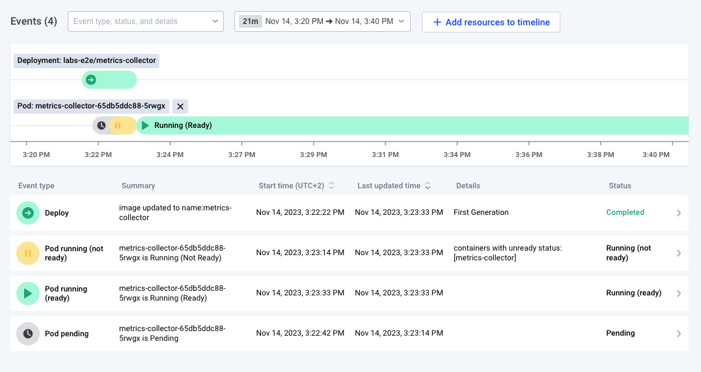
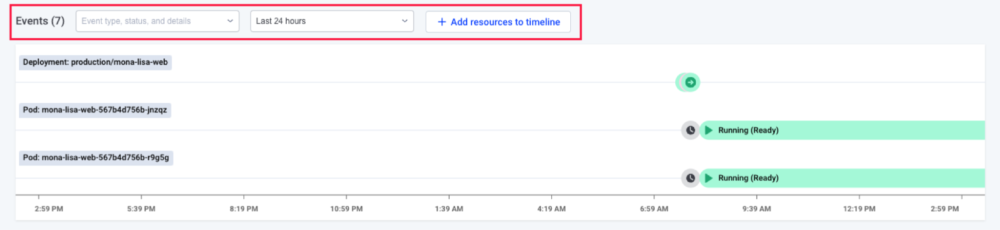
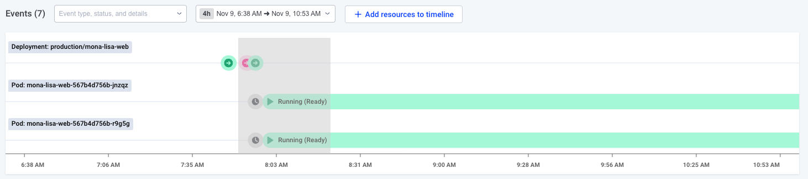
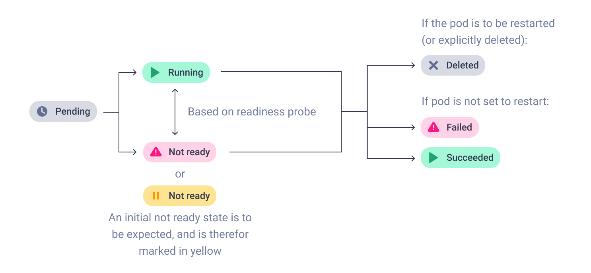
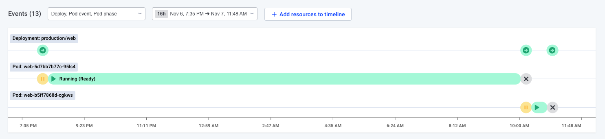
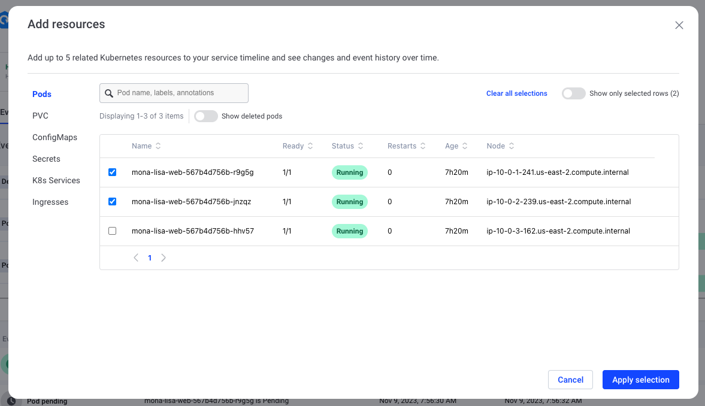

# Timeline

Komodor’s Timelines allow you to see the status of services, pods and different Kubernetes resources over time, all in one place to let you visually correlate issues and understand how things affect one another.

Timelines can be found in the following features:
- When looking at one specific Service in the Service page or the Service drawer
- The Events page \*

<small>\* The events page will often contain a lot of information in its default state. To prevent information overload, the timeline will switch to an aggregation over time graph at a certain threshold.</small>

## Using timelines

### Basics

Changing the time frame can be done via the dropdown menu on top of the timeline. The specific kinds of events shown can be filtered as well using the “Event type, status, and details” dropdown.

The selected time frame can also be changed by dragging in the timeline. After the mouse is released, the timeframe will be adjusted to zoom in on the selected range.

In the Events and Service views the timeline reflects the events in the table directly underneath it. Hovering over a row in the table will highlight the corresponding event on the timeline, and vice versa.

Clicking on these events will open up a drawer with more information pertaining to the specific event.

### Pods

In the case of Pods, due to their particular nature, individual events are not displayed. Rather, phases are presented instead.

The Pod phases displayed correspond to the [Kubernetes Pod Lifecycle](https://kubernetes.io/docs/concepts/workloads/pods/pod-lifecycle/), with some adjustments for ease of use and readability:
- **Pending**: displayed in gray, corresponds to the Pending phase. A pod is pending so long as the pod has been accepted by Kubernetes, but none of its containers have started running.
- **Running - ready**: displayed in green, corresponds to the Running state, in addition to the ready condition of the Pod being set to true. This means that at least one container is running, and no containers have the condition of ready set to false. In practice, this usually means that the Pod is running, and that the application is responding to readiness and liveness probes as configured.
- **Running - not ready**: displayed in red (or in yellow, if occurring immediately after Pending), corresponds to the Running phase, in addition to the ready condition of the Pod being set to false. This means that at least one container is running, but at least one container has the condition of ready set to false. This indicates that the pod is not ready, and may be malfunctioning, crashing etc. Note that this phase can occur right after a Pending phase, in which case it is colored yellow as some delay until readiness probes are run successfully.
- **Success**: displayed in green, corresponds to the Kubernetes Success phase. It means that all containers in the Pod have exited successfully and the Pod will not be restarted. It usually can be seen in Job runs.
- **Failed**: displayed in red, corresponds to the Failed phase. It means that at least one container has exited unsuccessfully, and that the Pod will not be restarted. It usually can be seen in Job runs.
- **Deleted**: displayed in gray, appears as a singular event. This event is fired when the Pod is deleted either automatically by Kubernetes or by a user’s request.

Here you can see an example of many of these different phases in action:

Clicking on a pod phase opens the Pod Phase drawer, which shows all events in the selected phase, as well as the latest Pod conditions (at the end of the phase if the phase has ended, or last known conditions if the phase is ongoing).

Times when Pod conditions have changed can also be seen by toggling on “Show status changes”

### Adding additional resources to the timeline

By default, the timeline will display some specific resources, such as the current service in the service view, as well as some related pods, or the current resources. If you wish to see a specific Kubernetes resource visualized on the timeline, however, clicking “Add resource to timeline” will present you with the following menu.

If you wish to, you may also add deleted pods to the timeline. For example, if you would like to find out why a certain pod has failed. To do so, switch on the “Show deleted pods” toggle and look for the relevant pod in the list below.

This can be useful when diagnosing issues that you suspect may involve other resources. For example, a PVC misbehaving could be affecting Pods, or an incorrect update to a Secret can prevent new Pods from being created correctly.
