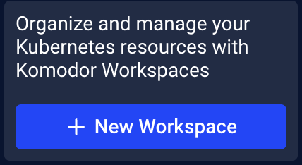
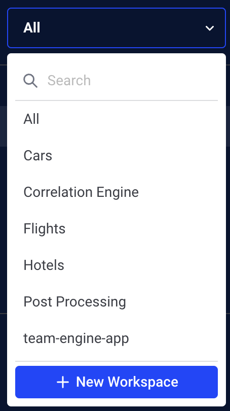
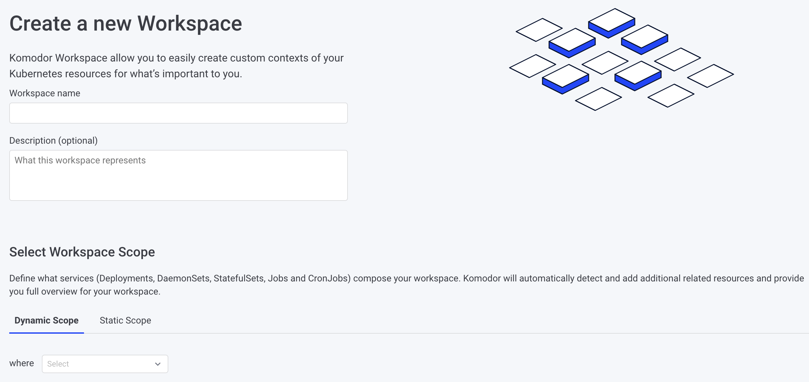
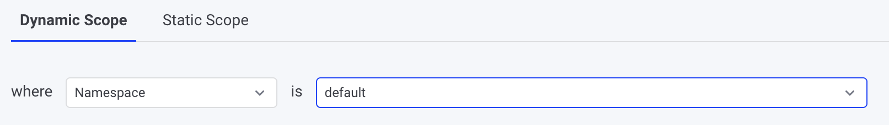
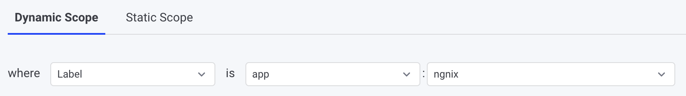
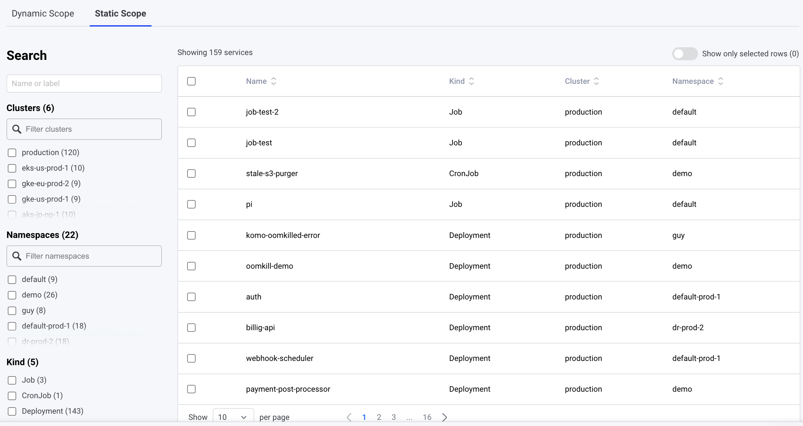
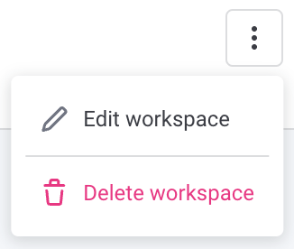

# Create a Workspace

To create Workspaces click the New Workspace button

- First Workspace creation  
You'll find the New Workspace button at the bottom of the navigation bar

- Any other workspace  
Open the list box on the top of the navigation toolbar  

You’ll be redirected to the Workspace creation page  

Specify a unique workspace name, add an optional description, and scope (options described below)

## Scoping a Workspace
You can create a workspace both dynamically based on existing configurations such as labels, and namespaces as well as by manually selecting the relevant services.

- Dynamic scope   
Allows for the creation of workspaces with dynamic scope, the user has to select a namespace or a label key:value pair and the workspace scope will consist of Workloads that are either part of the selected namespace or have the specified label across all of your clusters.

    Example usage:  

    - A namespace  
      
    
    - Label key:value pair  
    
    
- Manual scope    
Allows manually selecting the relevant Workloads to include in the workspace scope

> Note: You cannot use both methods together, it's one or another

## Editing / Deleting Workspaces
To edit or delete an existing Workspace, enter the Workspace and click the Edit button on the top right  

## Best practices
- It is recommended to limit your workspace scope to up to 100 workloads, surpassing this number could introduce a loading lag while entering the Overview page  
