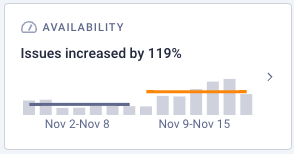
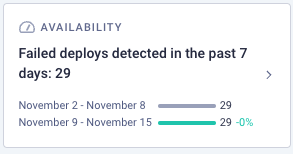
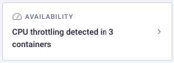
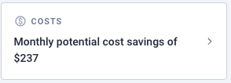
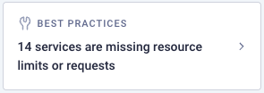
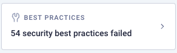
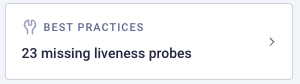

# Workspaces Insights
Komodor provides insights in multiple categories, every insight is clickable and will open a drawer with additional information related to the specific insight.

The insights are primarily based on events and data from the past 14 days, except for best practices insights, which are derived from the current resource configurations.

- Availability  

- Costs   

- Best practices  

