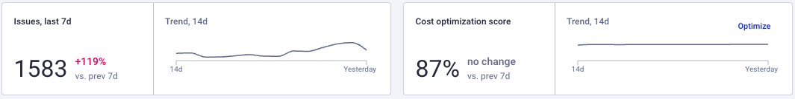
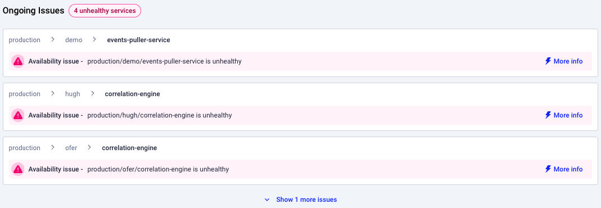
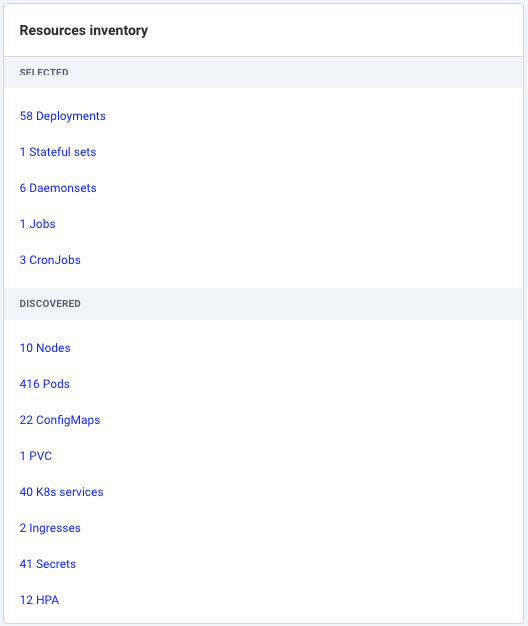
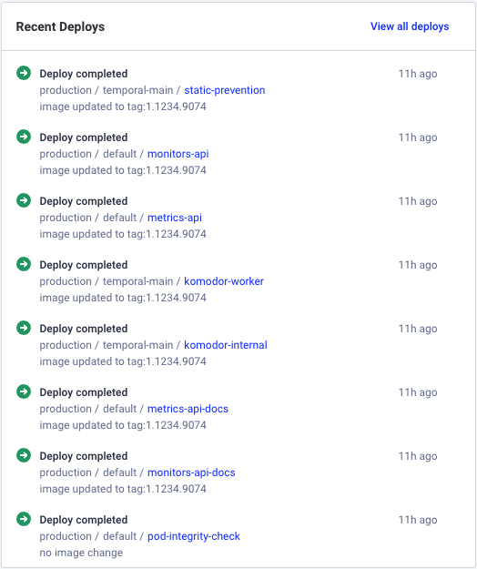

# Workspace Overview

The Overview offers a summary intended to assist in understanding the status of the workspace, encompassing aspects such as its resources and inner dependencies, workload availability, cost performance, and suggested best practices.

It is built to provide easy navigation through the Komodor platform.

The Workspaces overview page consists of the following:

- Summary data  
    Two charts describing the Availability issues trend alongside the cost optimization trend (i.e - how optimized your workspace is)  
    

- Open issues (if exist)  
    A list of open Availability issues associated with Workloads that are part of the workspace
    

- Inventory  
    A list of all the Workloads associated with the workspace broken down to the resource Kind they are generated from, alongside related resources discovered by Komodor  
    

- Latest deployments list   
    A list of the last 20 rollout events, for each deploy you’ll get a notion of whether it was a successful or a failed deployment as well as the Workload this event is related to  
    

- [Insights](./insights.md)
