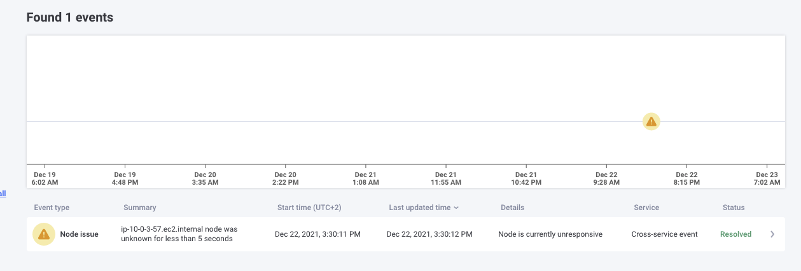
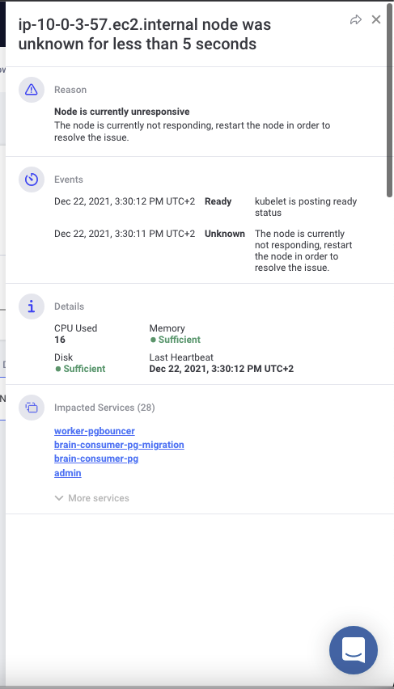
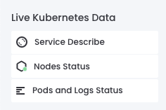
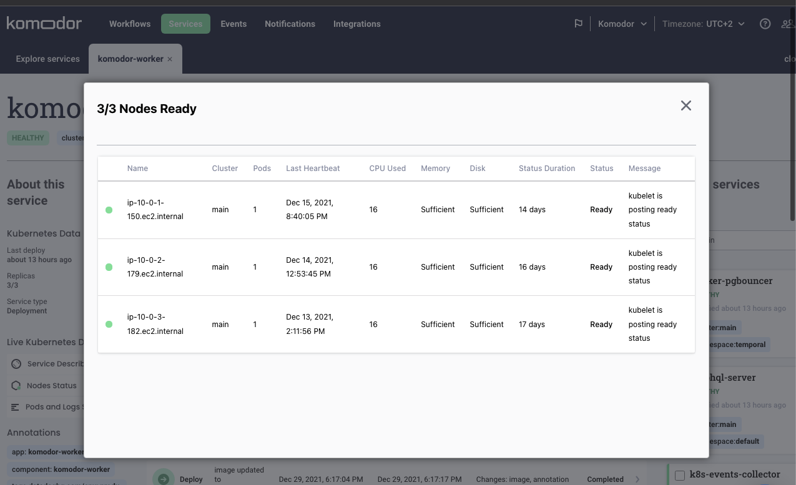

# Kubernetes Node visibility
## Node change event

Komodor kubernetes agent now reports changes in kubernetes nodes that will be displayed on the events tab in Komodor.

When kubernetes detects a node change it will report to Komodor the relevant data.

The details will also show you which service might have been impacted by this node change:

## Nodes status button for services

In the service screen there is now a button that will show you on which nodes your service is currently running on, and how many pods is running on a specific node.

In case for a node error you will see it once clicking the button:

## Installation

### Prerequisites

In order to see node live data make sure you are running [komodor-agent](https://github.com/komodorio/helm-charts/tree/master/charts/k8s-watcher) version `0.1.60` or higher. Also make sure the node resource watcher is on, you can do this as part of [helm configuration](https://github.com/komodorio/helm-charts/tree/master/charts/k8s-watcher#configuration).